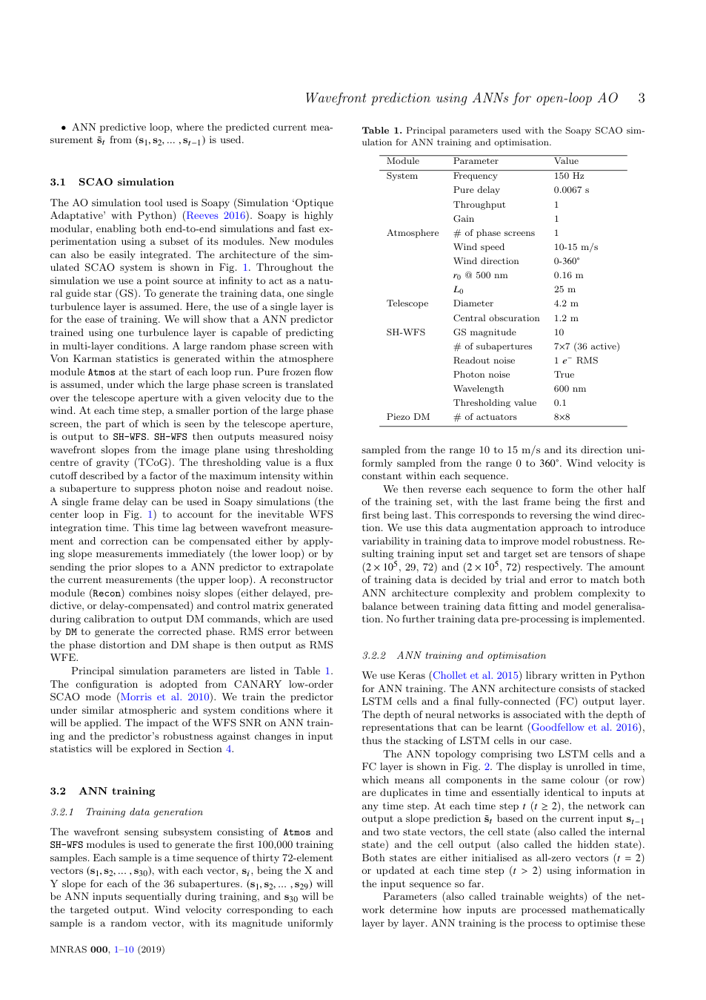
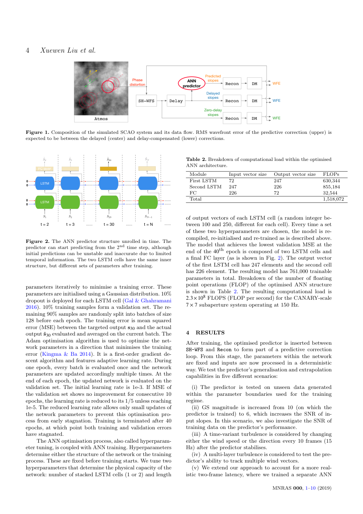
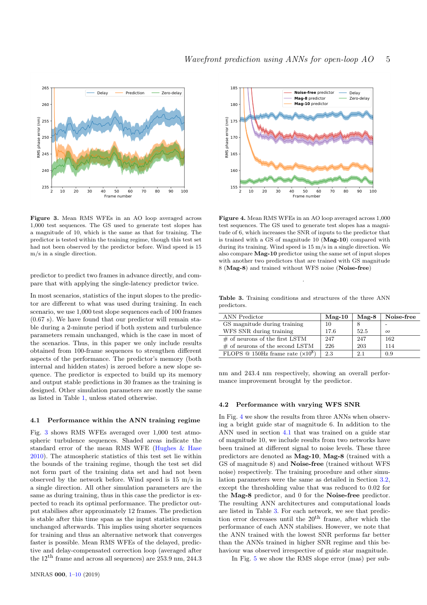
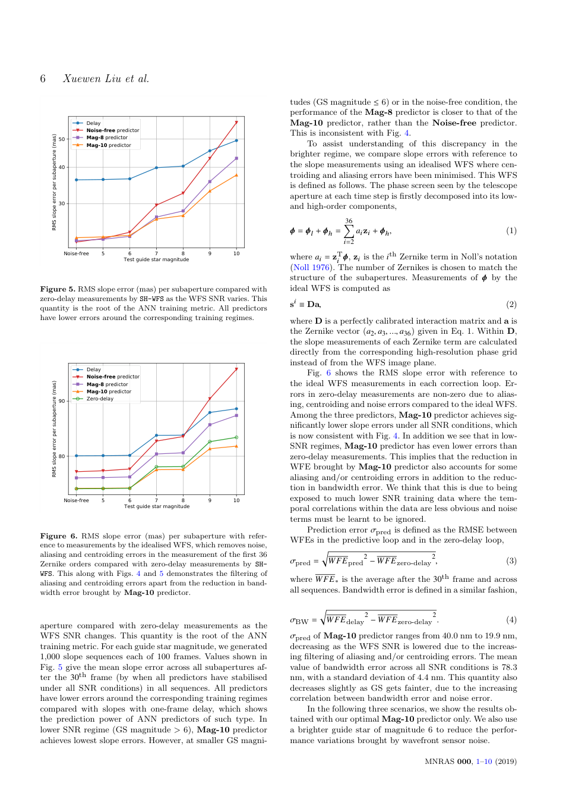
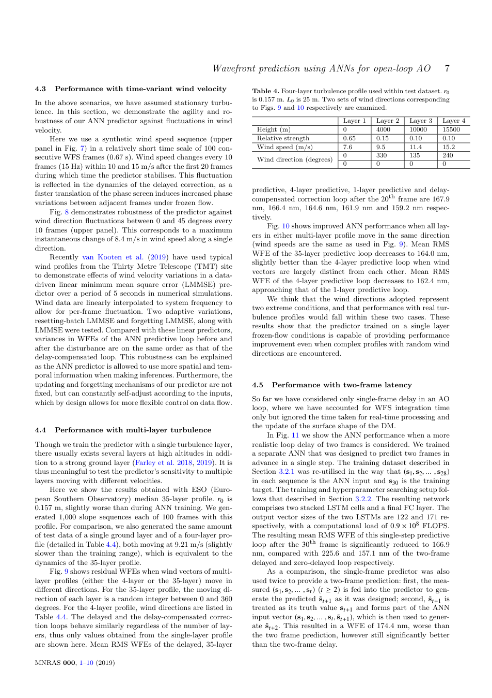

---
title: "Wavefront prediction using artificial neural networks for open-loop Adaptive Optics"
title_zh: "用于开环自适应光学的人工神经网络波前预测"
authors:
  - "Xuewen Liu"
  - "Tim Morris"
  - "Chris Saunter"
  - "Francisco Javier de Cos Juez"
  - "Carlos González-Gutiérrez"
  - "Lisa Bardou"
year: "2020"
venue: "MNRAS preprint / arXiv"
doi: ""
tags:
  - literature
  - method/deep-learning
  - optics/control
  - optics/adaptive-optics
  - task/wavefront-prediction
methods:
  - deep-learning
  - optical-control
material_system: "自适应光学，LSTM 波前预测"
task_type: "预测 Shack-Hartmann 波前传感器下一帧斜率以补偿 AO 控制延迟"
reading_status: "processed"
source_pdf: "source/2020-Liu-LSTM-wavefront-prediction-AO.pdf"
created: "2026-06-04"
---

# Wavefront prediction using artificial neural networks for open-loop Adaptive Optics

## 0. 文献元信息

### 0.1 基础信息

| 项目 | 内容 |
|---|---|
| 英文题名 | Wavefront prediction using artificial neural networks for open-loop Adaptive Optics |
| 中文题名 | 用于开环自适应光学的人工神经网络波前预测 |
| 作者 | Xuewen Liu, Tim Morris, Chris Saunter, Francisco Javier de Cos Juez, Carlos González-Gutiérrez, Lisa Bardou |
| 年份/来源 | 2020，MNRAS preprint / arXiv |
| DOI | PDF 中未稳定抽取 |
| 任务类型 | 预测 Shack-Hartmann 波前传感器下一帧斜率以补偿 AO 控制延迟 |
| 研究对象 | 自适应光学，LSTM 波前预测 |

### 0.2 Abstract 中英文对照

> 合规短摘：Latency in the control loop of adaptive optics (AO) systems can severely limit per- formance. Under the frozen flow hypothesis linear predictive control techniques can overcome this

**中文专业转述：**  
这篇论文围绕 自适应光学，LSTM 波前预测 中的核心控制难题展开。本文用 LSTM 预测 Shack-Hartmann 波前传感器下一帧斜率，从而补偿 AO 控制环中的单帧或多帧延迟；模型不需要显式估计风速等大气参数，而是从时间序列中学习湍流演化。 方法上，作者在 Soapy 模拟的 7×7 SCAO 系统中训练 LSTM，输入开放环 WFS slope 序列，输出未来 slope；比较导星星等、风速变化、风向变化、多层湍流和两帧延迟等情形。 结果层面，LSTM 显著降低单帧延迟下残余波前误差，并在风速、风向变化和多层湍流下保持稳定；训练噪声水平会影响网络是否同时滤除质心误差和混叠误差。

### 0.3 Conclusion 中英文对照

> 合规短摘：We have shown in extensive numerical simulations the po- tential of artificial neural networks as a nonlinear framework for wavefront prediction. The memory elements within the LSTM

**中文专业转述：**  
作者最终强调：LSTM 显著降低单帧延迟下残余波前误差，并在风速、风向变化和多层湍流下保持稳定；训练噪声水平会影响网络是否同时滤除质心误差和混叠误差。 同时，论文也留下了明确边界：主要基于仿真，性能依赖训练分布；两帧延迟下需要专门训练单步预测器，真实 AO 硬件和非平稳大气仍需进一步验证。

## 1. 快速总结表

| 模块 | 内容 |
|---|---|
| 文章信息 | 2020；MNRAS preprint / arXiv；Xuewen Liu 等 |
| 研究背景 | 光学控制系统中，相位或波前状态随时间变化，而传感、计算和执行存在延迟或不可直接观测的问题。 |
| 研究目的 | 预测 Shack-Hartmann 波前传感器下一帧斜率以补偿 AO 控制延迟 |
| 核心方法 | 作者在 Soapy 模拟的 7×7 SCAO 系统中训练 LSTM，输入开放环 WFS slope 序列，输出未来 slope；比较导星星等、风速变化、风向变化、多层湍流和两帧延迟等情形。 |
| 关键结果 | LSTM 显著降低单帧延迟下残余波前误差，并在风速、风向变化和多层湍流下保持稳定；训练噪声水平会影响网络是否同时滤除质心误差和混叠误差。 |
| 主要结论 | 本文用 LSTM 预测 Shack-Hartmann 波前传感器下一帧斜率，从而补偿 AO 控制环中的单帧或多帧延迟；模型不需要显式估计风速等大气参数，而是从时间序列中学习湍流演化。 |
| 文章好在哪里 | 它把深度学习放进具体物理控制链路，而不是只做通用图像识别；同时用指标、流程图和鲁棒性实验支持论证。 |
| 是否值得深读 | 值得，尤其适合做 CBC/AO 中“AI 预测 + 实时控制 + 物理约束”方向的文献基础。 |

## 2. 125 笔记整理表

| 类型 | 内容 | 对我研究/写作的用法 |
|---|---|---|
| 1 个思路 | 用神经网络从可观测图像或斜率序列中预测不可直接及时获得的控制变量。 | 可作为 CBC 相位控制、AO 延迟补偿、光场闭环控制的共同范式。 |
| 2 个图表 1 | 系统/数据流图展示从传感到模型再到控制的链路。 | 写方法章节时先画闭环，再讲模型。 |
| 2 个图表 2 | 性能对比图或表格展示预测方法相对非预测/传统方法的改善。 | 写结果章节时用“基线-模型-理想状态”三层对照。 |
| 5 个句式 1 | The observable intensity/slope pattern is treated as a proxy for the hidden control state. | 用于引出代理观测反演。 |
| 5 个句式 2 | The model reduces latency-induced error by predicting the future state before actuation. | 用于 AO 或实时控制论文。 |
| 5 个句式 3 | Performance must be evaluated at the downstream optical-control level, not only at prediction-error level. | 强调任务指标。 |
| 5 个句式 4 | Robustness is tested by varying noise, turbulence, delay, or array scale. | 写鲁棒性实验设计。 |
| 5 个句式 5 | The method is promising, but deployment depends on hardware timing and distribution shift. | 写局限与展望。 |

## 3. 图表证据链

### Table 1. Table 1. Principal parameters used with the Soapy SCAO sim- ulation for ANN training and optimisation. Module Parameter Value

| 维度 | 解析 |
|---|---|
| 目的 | 展示本文证据链中的 Table 1。批量抽取时保存为页面级截图，优先保证上下文不丢失。 |
| 描述 | Table 1. Principal parameters used with the Soapy SCAO sim- ulation for ANN training and optimisation. Module Parameter Value |
| 结论 | 该图/表服务于论文主线：本文用 LSTM 预测 Shack-Hartmann 波前传感器下一帧斜率，从而补偿 AO 控制环中的单帧或多帧延迟；模型不需要显式估计风速等大气参数，而是从时间序列中学习湍流演化。 |
| 支撑 | 它把方法、数据或结果中的一个环节可视化，帮助判断模型是否真正改善了相位或波前控制。 |
| 可复用性 | 可作为未来写作中“系统流程、模型结构、性能对比或鲁棒性验证”的图表组织参考。 |
### Figure 1. Figure 1. Composition of the simulated SCAO system and its data flow. RMS wavefront error of the predictive correction (upper) is expected to be between the delayed (center) and delay-compensated (lower) corrections. LSTM …… 0

| 维度 | 解析 |
|---|---|
| 目的 | 展示本文证据链中的 Figure 1。批量抽取时保存为页面级截图，优先保证上下文不丢失。 |
| 描述 | Figure 1. Composition of the simulated SCAO system and its data flow. RMS wavefront error of the predictive correction (upper) is expected to be between the delayed (center) and delay-compensated (lower) corrections. LSTM …… 0 |
| 结论 | 该图/表服务于论文主线：本文用 LSTM 预测 Shack-Hartmann 波前传感器下一帧斜率，从而补偿 AO 控制环中的单帧或多帧延迟；模型不需要显式估计风速等大气参数，而是从时间序列中学习湍流演化。 |
| 支撑 | 它把方法、数据或结果中的一个环节可视化，帮助判断模型是否真正改善了相位或波前控制。 |
| 可复用性 | 可作为未来写作中“系统流程、模型结构、性能对比或鲁棒性验证”的图表组织参考。 |
### Figure 2. Figure 2. The ANN predictor structure unrolled in time. The predictor can start predicting from the 2nd time step, although initial predictions can be unstable and inaccurate due to limited temporal information. The two LSTM cells have the same inner structure, but different sets of parameters after training.

| 维度 | 解析 |
|---|---|
| 目的 | 展示本文证据链中的 Figure 2。批量抽取时保存为页面级截图，优先保证上下文不丢失。 |
| 描述 | Figure 2. The ANN predictor structure unrolled in time. The predictor can start predicting from the 2nd time step, although initial predictions can be unstable and inaccurate due to limited temporal information. The two LSTM cells have the same inner structure, but different sets of parameters after training. |
| 结论 | 该图/表服务于论文主线：本文用 LSTM 预测 Shack-Hartmann 波前传感器下一帧斜率，从而补偿 AO 控制环中的单帧或多帧延迟；模型不需要显式估计风速等大气参数，而是从时间序列中学习湍流演化。 |
| 支撑 | 它把方法、数据或结果中的一个环节可视化，帮助判断模型是否真正改善了相位或波前控制。 |
| 可复用性 | 可作为未来写作中“系统流程、模型结构、性能对比或鲁棒性验证”的图表组织参考。 |
### Table 2. Table 2. Breakdown of computational load within the optimised ANN architecture. Module Input vector size Output vector size

| 维度 | 解析 |
|---|---|
| 目的 | 展示本文证据链中的 Table 2。批量抽取时保存为页面级截图，优先保证上下文不丢失。 |
| 描述 | Table 2. Breakdown of computational load within the optimised ANN architecture. Module Input vector size Output vector size |
| 结论 | 该图/表服务于论文主线：本文用 LSTM 预测 Shack-Hartmann 波前传感器下一帧斜率，从而补偿 AO 控制环中的单帧或多帧延迟；模型不需要显式估计风速等大气参数，而是从时间序列中学习湍流演化。 |
| 支撑 | 它把方法、数据或结果中的一个环节可视化，帮助判断模型是否真正改善了相位或波前控制。 |
| 可复用性 | 可作为未来写作中“系统流程、模型结构、性能对比或鲁棒性验证”的图表组织参考。 |
### Figure 3. Figure 3. Mean RMS WFEs in an AO loop averaged across 1,000 test sequences. The GS used to generate test slopes has a magnitude of 10, which is the same as that for training. The predictor is tested within the training regime, though this test set had not been observed by the predictor before. Wind speed is 15

| 维度 | 解析 |
|---|---|
| 目的 | 展示本文证据链中的 Figure 3。批量抽取时保存为页面级截图，优先保证上下文不丢失。 |
| 描述 | Figure 3. Mean RMS WFEs in an AO loop averaged across 1,000 test sequences. The GS used to generate test slopes has a magnitude of 10, which is the same as that for training. The predictor is tested within the training regime, though this test set had not been observed by the predictor before. Wind speed is 15 |
| 结论 | 该图/表服务于论文主线：本文用 LSTM 预测 Shack-Hartmann 波前传感器下一帧斜率，从而补偿 AO 控制环中的单帧或多帧延迟；模型不需要显式估计风速等大气参数，而是从时间序列中学习湍流演化。 |
| 支撑 | 它把方法、数据或结果中的一个环节可视化，帮助判断模型是否真正改善了相位或波前控制。 |
| 可复用性 | 可作为未来写作中“系统流程、模型结构、性能对比或鲁棒性验证”的图表组织参考。 |
### Figure 4. Figure 4. Mean RMS WFEs in an AO loop averaged across 1,000 test sequences. The GS used to generate test slopes has a magni- tude of 6, which increases the SNR of inputs to the predictor that is trained with a GS of magnitude 10 (Mag-10) compared with during its training. Wind speed is 15 m/s in a single direction. We

| 维度 | 解析 |
|---|---|
| 目的 | 展示本文证据链中的 Figure 4。批量抽取时保存为页面级截图，优先保证上下文不丢失。 |
| 描述 | Figure 4. Mean RMS WFEs in an AO loop averaged across 1,000 test sequences. The GS used to generate test slopes has a magni- tude of 6, which increases the SNR of inputs to the predictor that is trained with a GS of magnitude 10 (Mag-10) compared with during its training. Wind speed is 15 m/s in a single direction. We |
| 结论 | 该图/表服务于论文主线：本文用 LSTM 预测 Shack-Hartmann 波前传感器下一帧斜率，从而补偿 AO 控制环中的单帧或多帧延迟；模型不需要显式估计风速等大气参数，而是从时间序列中学习湍流演化。 |
| 支撑 | 它把方法、数据或结果中的一个环节可视化，帮助判断模型是否真正改善了相位或波前控制。 |
| 可复用性 | 可作为未来写作中“系统流程、模型结构、性能对比或鲁棒性验证”的图表组织参考。 |
### Table 3. Table 3. Training conditions and structures of the three ANN predictors. ANN Predictor Mag-10 Mag-8

| 维度 | 解析 |
|---|---|
| 目的 | 展示本文证据链中的 Table 3。批量抽取时保存为页面级截图，优先保证上下文不丢失。 |
| 描述 | Table 3. Training conditions and structures of the three ANN predictors. ANN Predictor Mag-10 Mag-8 |
| 结论 | 该图/表服务于论文主线：本文用 LSTM 预测 Shack-Hartmann 波前传感器下一帧斜率，从而补偿 AO 控制环中的单帧或多帧延迟；模型不需要显式估计风速等大气参数，而是从时间序列中学习湍流演化。 |
| 支撑 | 它把方法、数据或结果中的一个环节可视化，帮助判断模型是否真正改善了相位或波前控制。 |
| 可复用性 | 可作为未来写作中“系统流程、模型结构、性能对比或鲁棒性验证”的图表组织参考。 |
### Figure 5. Figure 5. RMS slope error (mas) per subaperture compared with zero-delay measurements by SH-WFS as the WFS SNR varies. This quantity is the root of the ANN training metric. All predictors have lower errors around the corresponding training regimes. Noise-free

| 维度 | 解析 |
|---|---|
| 目的 | 展示本文证据链中的 Figure 5。批量抽取时保存为页面级截图，优先保证上下文不丢失。 |
| 描述 | Figure 5. RMS slope error (mas) per subaperture compared with zero-delay measurements by SH-WFS as the WFS SNR varies. This quantity is the root of the ANN training metric. All predictors have lower errors around the corresponding training regimes. Noise-free |
| 结论 | 该图/表服务于论文主线：本文用 LSTM 预测 Shack-Hartmann 波前传感器下一帧斜率，从而补偿 AO 控制环中的单帧或多帧延迟；模型不需要显式估计风速等大气参数，而是从时间序列中学习湍流演化。 |
| 支撑 | 它把方法、数据或结果中的一个环节可视化，帮助判断模型是否真正改善了相位或波前控制。 |
| 可复用性 | 可作为未来写作中“系统流程、模型结构、性能对比或鲁棒性验证”的图表组织参考。 |
### Figure 6. Figure 6. RMS slope error (mas) per subaperture with refer- ence to measurements by the idealised WFS, which removes noise, aliasing and centroiding errors in the measurement of the first 36 Zernike orders compared with zero-delay measurements by SH- WFS. This along with Figs. 4 and 5 demonstrates the filtering of

| 维度 | 解析 |
|---|---|
| 目的 | 展示本文证据链中的 Figure 6。批量抽取时保存为页面级截图，优先保证上下文不丢失。 |
| 描述 | Figure 6. RMS slope error (mas) per subaperture with refer- ence to measurements by the idealised WFS, which removes noise, aliasing and centroiding errors in the measurement of the first 36 Zernike orders compared with zero-delay measurements by SH- WFS. This along with Figs. 4 and 5 demonstrates the filtering of |
| 结论 | 该图/表服务于论文主线：本文用 LSTM 预测 Shack-Hartmann 波前传感器下一帧斜率，从而补偿 AO 控制环中的单帧或多帧延迟；模型不需要显式估计风速等大气参数，而是从时间序列中学习湍流演化。 |
| 支撑 | 它把方法、数据或结果中的一个环节可视化，帮助判断模型是否真正改善了相位或波前控制。 |
| 可复用性 | 可作为未来写作中“系统流程、模型结构、性能对比或鲁棒性验证”的图表组织参考。 |
### Figure 7. Figure 7. Robustness of the predictor against wind speed fluctu- ations between 10 and 15 m/s every 10 frames. Wind direction is 0 degree. Guide star magnitude is 6. 0 15

| 维度 | 解析 |
|---|---|
| 目的 | 展示本文证据链中的 Figure 7。批量抽取时保存为页面级截图，优先保证上下文不丢失。 |
| 描述 | Figure 7. Robustness of the predictor against wind speed fluctu- ations between 10 and 15 m/s every 10 frames. Wind direction is 0 degree. Guide star magnitude is 6. 0 15 |
| 结论 | 该图/表服务于论文主线：本文用 LSTM 预测 Shack-Hartmann 波前传感器下一帧斜率，从而补偿 AO 控制环中的单帧或多帧延迟；模型不需要显式估计风速等大气参数，而是从时间序列中学习湍流演化。 |
| 支撑 | 它把方法、数据或结果中的一个环节可视化，帮助判断模型是否真正改善了相位或波前控制。 |
| 可复用性 | 可作为未来写作中“系统流程、模型结构、性能对比或鲁棒性验证”的图表组织参考。 |
### Figure 8. Figure 8. Robustness of the predictor against wind direction fluc- tuations between 0 and 45 degrees every 10 frames. Wind speed is 15 m/s. Guide star magnitude is 6. 2 10

| 维度 | 解析 |
|---|---|
| 目的 | 展示本文证据链中的 Figure 8。批量抽取时保存为页面级截图，优先保证上下文不丢失。 |
| 描述 | Figure 8. Robustness of the predictor against wind direction fluc- tuations between 0 and 45 degrees every 10 frames. Wind speed is 15 m/s. Guide star magnitude is 6. 2 10 |
| 结论 | 该图/表服务于论文主线：本文用 LSTM 预测 Shack-Hartmann 波前传感器下一帧斜率，从而补偿 AO 控制环中的单帧或多帧延迟；模型不需要显式估计风速等大气参数，而是从时间序列中学习湍流演化。 |
| 支撑 | 它把方法、数据或结果中的一个环节可视化，帮助判断模型是否真正改善了相位或波前控制。 |
| 可复用性 | 可作为未来写作中“系统流程、模型结构、性能对比或鲁棒性验证”的图表组织参考。 |
### Figure 9. Figure 9. ANN performance with multiple turbulence layers mov- ing along different directions. Wind speeds of either the 1- or 4- layer profile are scaled to maintain the same dynamics as that of the 35-layer profile. r0 is 0.157 m. 2

| 维度 | 解析 |
|---|---|
| 目的 | 展示本文证据链中的 Figure 9。批量抽取时保存为页面级截图，优先保证上下文不丢失。 |
| 描述 | Figure 9. ANN performance with multiple turbulence layers mov- ing along different directions. Wind speeds of either the 1- or 4- layer profile are scaled to maintain the same dynamics as that of the 35-layer profile. r0 is 0.157 m. 2 |
| 结论 | 该图/表服务于论文主线：本文用 LSTM 预测 Shack-Hartmann 波前传感器下一帧斜率，从而补偿 AO 控制环中的单帧或多帧延迟；模型不需要显式估计风速等大气参数，而是从时间序列中学习湍流演化。 |
| 支撑 | 它把方法、数据或结果中的一个环节可视化，帮助判断模型是否真正改善了相位或波前控制。 |
| 可复用性 | 可作为未来写作中“系统流程、模型结构、性能对比或鲁棒性验证”的图表组织参考。 |
### Figure 10. Figure 10. ANN performance with multiple turbulence layers moving along the same direction. Compared with Fig. 9, the ANN performance suffers from the increased number of wind vectors, but mainly from the variety among those vectors. 5

| 维度 | 解析 |
|---|---|
| 目的 | 展示本文证据链中的 Figure 10。批量抽取时保存为页面级截图，优先保证上下文不丢失。 |
| 描述 | Figure 10. ANN performance with multiple turbulence layers moving along the same direction. Compared with Fig. 9, the ANN performance suffers from the increased number of wind vectors, but mainly from the variety among those vectors. 5 |
| 结论 | 该图/表服务于论文主线：本文用 LSTM 预测 Shack-Hartmann 波前传感器下一帧斜率，从而补偿 AO 控制环中的单帧或多帧延迟；模型不需要显式估计风速等大气参数，而是从时间序列中学习湍流演化。 |
| 支撑 | 它把方法、数据或结果中的一个环节可视化，帮助判断模型是否真正改善了相位或波前控制。 |
| 可复用性 | 可作为未来写作中“系统流程、模型结构、性能对比或鲁棒性验证”的图表组织参考。 |
### Figure 11. Figure 11. In a simulated system with a two-frame latency, the methodology adopted for the single-latency prediction is extended to training a separate ANN predictor (single-step prediction). In this case, the single-latency predictor can also be used twice (two- step prediction), albeit with worse performance. Both predictors

| 维度 | 解析 |
|---|---|
| 目的 | 展示本文证据链中的 Figure 11。批量抽取时保存为页面级截图，优先保证上下文不丢失。 |
| 描述 | Figure 11. In a simulated system with a two-frame latency, the methodology adopted for the single-latency prediction is extended to training a separate ANN predictor (single-step prediction). In this case, the single-latency predictor can also be used twice (two- step prediction), albeit with worse performance. Both predictors |
| 结论 | 该图/表服务于论文主线：本文用 LSTM 预测 Shack-Hartmann 波前传感器下一帧斜率，从而补偿 AO 控制环中的单帧或多帧延迟；模型不需要显式估计风速等大气参数，而是从时间序列中学习湍流演化。 |
| 支撑 | 它把方法、数据或结果中的一个环节可视化，帮助判断模型是否真正改善了相位或波前控制。 |
| 可复用性 | 可作为未来写作中“系统流程、模型结构、性能对比或鲁棒性验证”的图表组织参考。 |
### Table 4. Table 4.4. The delayed and the delay-compensated correc- tion loops behave similarly regardless of the number of lay- ers, thus only values obtained from the single-layer profile are shown here. Mean RMS WFEs of the delayed, 35-layer

| 维度 | 解析 |
|---|---|
| 目的 | 展示本文证据链中的 Table 4。批量抽取时保存为页面级截图，优先保证上下文不丢失。 |
| 描述 | Table 4.4. The delayed and the delay-compensated correc- tion loops behave similarly regardless of the number of lay- ers, thus only values obtained from the single-layer profile are shown here. Mean RMS WFEs of the delayed, 35-layer |
| 结论 | 该图/表服务于论文主线：本文用 LSTM 预测 Shack-Hartmann 波前传感器下一帧斜率，从而补偿 AO 控制环中的单帧或多帧延迟；模型不需要显式估计风速等大气参数，而是从时间序列中学习湍流演化。 |
| 支撑 | 它把方法、数据或结果中的一个环节可视化，帮助判断模型是否真正改善了相位或波前控制。 |
| 可复用性 | 可作为未来写作中“系统流程、模型结构、性能对比或鲁棒性验证”的图表组织参考。 |

## 4. 方法与图表复用

这篇论文最值得复用的是“物理系统问题定义 → 可观测代理信号 → 神经网络预测 → 控制补偿 → 下游光学指标验证”的写作路径。对于 CBC 论文，重点看相位误差如何被预测并转化为补偿；对于 AO 论文，重点看延迟波前如何被预测并转化为残差下降。

## 5. 中英陪读

| 关键词 | 中文解释 |
|---|---|
| coherent beam combining | 相干光束合成，通过控制多路光束相位使其叠加成高质量输出。 |
| adaptive optics | 自适应光学，通过实时测量和校正波前畸变改善成像或传输质量。 |
| wavefront prediction | 波前预测，用历史观测估计未来波前以补偿控制延迟。 |
| phase control | 相位控制，使不同通道保持目标相位关系。 |
| open-loop correction | 开环校正，控制量不直接依赖校正后的即时反馈，因而更依赖预测准确性。 |

## 6. Daedalus 深度剖析

### Act I: Opening Gambit - 核心价值命题

本文用 LSTM 预测 Shack-Hartmann 波前传感器下一帧斜率，从而补偿 AO 控制环中的单帧或多帧延迟；模型不需要显式估计风速等大气参数，而是从时间序列中学习湍流演化。 这类论文的战略意义在于，它把光学系统中的“慢反馈”和“不可观测隐变量”问题，转化为机器学习可以处理的预测或反演问题。

### Act II: Narrative Unfolding - 从真实工程到科学核心

真实工程痛点是：光学系统并不会等控制器慢慢计算。CBC 中相位噪声会持续漂移；AO 中大气湍流会在传感、计算和变形镜响应之间继续演化。因此，系统需要提前知道或快速反推出下一步该如何补偿。

### Act III: Technical Heart - 方法核心

作者在 Soapy 模拟的 7×7 SCAO 系统中训练 LSTM，输入开放环 WFS slope 序列，输出未来 slope；比较导星星等、风速变化、风向变化、多层湍流和两帧延迟等情形。 技术上最重要的是输入输出定义：输入不是抽象向量，而是带有物理含义的强度图、波前斜率或时间序列；输出也不是普通分类标签，而是相位、波前或补偿相关的连续控制量。

### Act IV: Chain Of Evidence - 结果证据链

本文图表从系统结构、模型结构、训练/测试设置、性能比较和鲁棒性分析几个层面组织证据。`## 3` 中列出的每个图表都对应证据链的一环：先证明系统和数据可信，再证明模型有效，最后证明方法在噪声、延迟、规模或目标变化下仍有边界内的稳定性。

### Act V: Intellectual Distillation - 页外洞察

关键洞察是：深度学习在这里不是替代物理，而是学习物理系统中难以显式建模或难以及时测量的映射。它的成功依赖训练分布覆盖、传感链路稳定、输出变量定义合理，以及评价指标真正对应光学任务。

### Act VI: Legacy And Outlook - 迁移与未来方向

未来可以沿三条线推进：第一，把模型部署到更真实的硬件闭环中，测量端到端延迟；第二，用物理约束或仿真-实验混合数据提升泛化；第三，面向更大阵列、更强湍流或更复杂目标光场做规模化验证。

## 7. 写作素材库

| 用途 | 可复用表达 |
|---|---|
| 引出问题 | 光学控制的关键瓶颈不是缺少测量，而是测量、推理和执行之间存在时间差与隐变量。 |
| 方法表述 | 将可观测光场图样或 WFS slope 序列作为隐藏相位/波前状态的代理信号。 |
| 结果表述 | 方法的价值应通过最终光学质量指标验证，而不仅是网络预测误差。 |
| 局限表述 | 部署性能取决于硬件延迟、训练分布、噪声模型和跨场景泛化能力。 |

## 8. 局限与复核清单

| 项目 | 状态 |
|---|---|
| PDF 文本抽取 | PyMuPDF 抽取成功，共 10 页。 |
| 图表抽取 | 已保存 11 张 Figure 页面截图、4 张 Table 页面截图。 |
| 抽取精度 | 批量模式采用页面级截图，可靠保留上下文，但不是所有图表都做了精确裁剪。 |
| Abstract/Conclusion | 因版权合规限制，仅放短摘和中文专业转述。 |
| 需人工复核 | 建议打开 Typora 检查页面截图是否需要后续手工裁剪成更精确的图。 |

## 本论文的通用知识迁移总结

- **核心思想**：把光学系统中的不可见或未来状态转化为可学习的预测/反演任务。
- **可复用模块**：代理观测、深度学习预测器、闭环补偿、鲁棒性扫描、下游光学指标验证。
- **关键避坑指南**：不要只报告模型误差；一定要说明硬件时延、噪声、训练分布和物理可达性边界。
