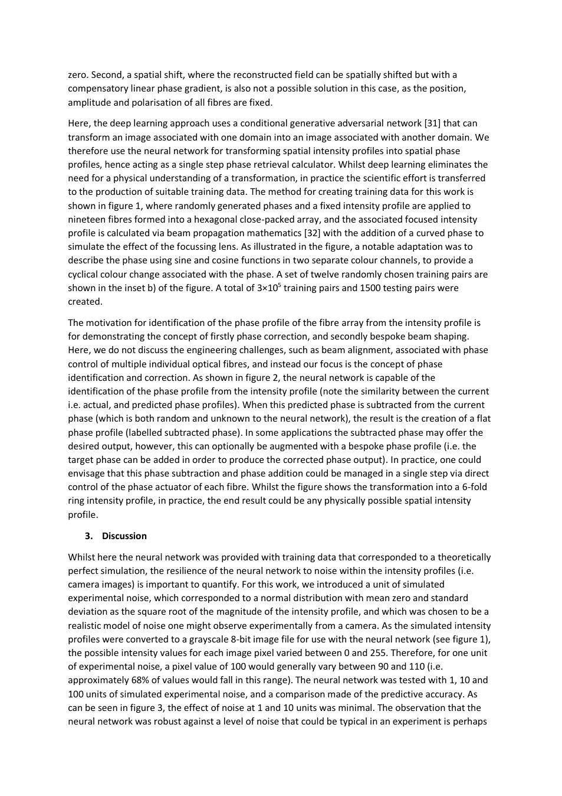
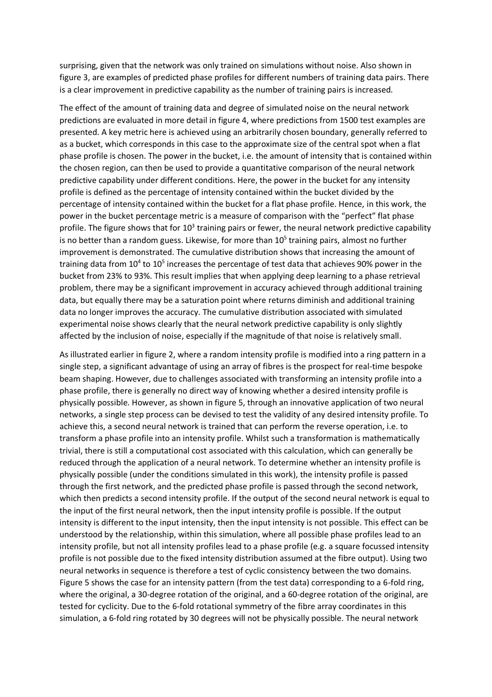

---
title: "Single Step Phase Optimisation for Coherent Beam Combination using Deep Learning"
title_zh: "基于深度学习的相干光束合成单步相位优化"
authors:
  - "Ben Mills"
  - "James A. Grant-Jacob"
  - "Matthew Praeger"
  - "Robert W. Eason"
  - "Johan Nilsson"
  - "Michalis N. Zervas"
year: "2022"
venue: "Scientific Reports"
doi: ""
tags:
  - literature
  - method/deep-learning
  - optics/control
  - optics/coherent-beam-combining
  - task/phase-control
methods:
  - deep-learning
  - optical-control
material_system: "相干光束合成，conditional GAN，相位优化"
task_type: "从 19 芯 CBC 焦平面强度图单步预测相位并实现定制光束整形"
reading_status: "processed"
source_pdf: "source/2022-Mills-single-step-phase-optimisation-CBC.pdf"
created: "2026-06-04"
---

# Single Step Phase Optimisation for Coherent Beam Combination using Deep Learning

## 0. 文献元信息

### 0.1 基础信息

| 项目 | 内容 |
|---|---|
| 英文题名 | Single Step Phase Optimisation for Coherent Beam Combination using Deep Learning |
| 中文题名 | 基于深度学习的相干光束合成单步相位优化 |
| 作者 | Ben Mills, James A. Grant-Jacob, Matthew Praeger, Robert W. Eason, Johan Nilsson, Michalis N. Zervas |
| 年份/来源 | 2022，Scientific Reports |
| DOI | PDF 中未稳定抽取 |
| 任务类型 | 从 19 芯 CBC 焦平面强度图单步预测相位并实现定制光束整形 |
| 研究对象 | 相干光束合成，conditional GAN，相位优化 |

### 0.2 Abstract 中英文对照

> 合规短摘：Coherent beam combination of multiple fibres can be used to overcome limitations such as the power handling capability of single fibre configurations. In such a scheme, the focal i

**中文专业转述：**  
这篇论文围绕 相干光束合成，conditional GAN，相位优化 中的核心控制难题展开。本文证明 conditional GAN 可以在约 10 ms 单步内，从 19 芯六角阵列的焦平面强度图预测相位图，进而完成相位校正、定制光束整形，并判断目标强度图是否物理可实现。 方法上，作者用束传播仿真生成 256×256 强度图与对应相位图；强度到相位网络用于相位补偿，逆向相位到强度网络用于循环可行性测试。 结果层面，训练数据增多显著提升预测能力；网络对模拟实验噪声具有韧性；30 度旋转的环形目标因六重对称性不可达，正反网络循环测试能够识别这种不可行目标。

### 0.3 Conclusion 中英文对照

> 合规短摘：In conclusion, a method for predicting the phase of nineteen fibres arranged in a hexagonal close- packed array directly from the simulated focal intensity was shown, which has dir

**中文专业转述：**  
作者最终强调：训练数据增多显著提升预测能力；网络对模拟实验噪声具有韧性；30 度旋转的环形目标因六重对称性不可达，正反网络循环测试能够识别这种不可行目标。 同时，论文也留下了明确边界：这仍是仿真研究，真实实验中的光束不均匀、执行器时延、相位漂移、标定误差和噪声分布需要后续验证。

## 1. 快速总结表

| 模块 | 内容 |
|---|---|
| 文章信息 | 2022；Scientific Reports；Ben Mills 等 |
| 研究背景 | 光学控制系统中，相位或波前状态随时间变化，而传感、计算和执行存在延迟或不可直接观测的问题。 |
| 研究目的 | 从 19 芯 CBC 焦平面强度图单步预测相位并实现定制光束整形 |
| 核心方法 | 作者用束传播仿真生成 256×256 强度图与对应相位图；强度到相位网络用于相位补偿，逆向相位到强度网络用于循环可行性测试。 |
| 关键结果 | 训练数据增多显著提升预测能力；网络对模拟实验噪声具有韧性；30 度旋转的环形目标因六重对称性不可达，正反网络循环测试能够识别这种不可行目标。 |
| 主要结论 | 本文证明 conditional GAN 可以在约 10 ms 单步内，从 19 芯六角阵列的焦平面强度图预测相位图，进而完成相位校正、定制光束整形，并判断目标强度图是否物理可实现。 |
| 文章好在哪里 | 它把深度学习放进具体物理控制链路，而不是只做通用图像识别；同时用指标、流程图和鲁棒性实验支持论证。 |
| 是否值得深读 | 值得，尤其适合做 CBC/AO 中“AI 预测 + 实时控制 + 物理约束”方向的文献基础。 |

## 2. 125 笔记整理表

| 类型 | 内容 | 对我研究/写作的用法 |
|---|---|---|
| 1 个思路 | 用神经网络从可观测图像或斜率序列中预测不可直接及时获得的控制变量。 | 可作为 CBC 相位控制、AO 延迟补偿、光场闭环控制的共同范式。 |
| 2 个图表 1 | 系统/数据流图展示从传感到模型再到控制的链路。 | 写方法章节时先画闭环，再讲模型。 |
| 2 个图表 2 | 性能对比图或表格展示预测方法相对非预测/传统方法的改善。 | 写结果章节时用“基线-模型-理想状态”三层对照。 |
| 5 个句式 1 | The observable intensity/slope pattern is treated as a proxy for the hidden control state. | 用于引出代理观测反演。 |
| 5 个句式 2 | The model reduces latency-induced error by predicting the future state before actuation. | 用于 AO 或实时控制论文。 |
| 5 个句式 3 | Performance must be evaluated at the downstream optical-control level, not only at prediction-error level. | 强调任务指标。 |
| 5 个句式 4 | Robustness is tested by varying noise, turbulence, delay, or array scale. | 写鲁棒性实验设计。 |
| 5 个句式 5 | The method is promising, but deployment depends on hardware timing and distribution shift. | 写局限与展望。 |

## 3. 图表证据链

### Figure 1. Fig. 1. Process for creation of training data suitable for training a neural network to transform a focal intensity profile into the associated phase profile that shows the phase of each fibre. Showing a) schematic of application of beam propagation simulation for creating neural network training data, which produces a 256×256 intensity image and associated 256×256 phase image. Showing b) twelve examples of training data pairs.

| 维度 | 解析 |
|---|---|
| 目的 | 展示本文证据链中的 Figure 1。批量抽取时保存为页面级截图，优先保证上下文不丢失。 |
| 描述 | Fig. 1. Process for creation of training data suitable for training a neural network to transform a focal intensity profile into the associated phase profile that shows the phase of each fibre. Showing a) schematic of application of beam propagation simulation for creating neural network training data, which produces a 256×256 intensity image and associated 256×256 phase image. Showing b) twelve examples of training data pairs. |
| 结论 | 该图/表服务于论文主线：本文证明 conditional GAN 可以在约 10 ms 单步内，从 19 芯六角阵列的焦平面强度图预测相位图，进而完成相位校正、定制光束整形，并判断目标强度图是否物理可实现。 |
| 支撑 | 它把方法、数据或结果中的一个环节可视化，帮助判断模型是否真正改善了相位或波前控制。 |
| 可复用性 | 可作为未来写作中“系统流程、模型结构、性能对比或鲁棒性验证”的图表组织参考。 |
### Figure 2. Fig 2. Application of a neural network for bespoke beam shaping for any phase that is unknown to the network. Starting from a current phase (which is unknown to the neural network), the associated simulated intensity is processed by the neural network and the phase is predicted. Subtracting the predicted phase profile from the (hidden) current phase profile produces a flat phase, with error depending on the prediction accuracy. At the same time, the phase profile for a desired intensity

| 维度 | 解析 |
|---|---|
| 目的 | 展示本文证据链中的 Figure 2。批量抽取时保存为页面级截图，优先保证上下文不丢失。 |
| 描述 | Fig 2. Application of a neural network for bespoke beam shaping for any phase that is unknown to the network. Starting from a current phase (which is unknown to the neural network), the associated simulated intensity is processed by the neural network and the phase is predicted. Subtracting the predicted phase profile from the (hidden) current phase profile produces a flat phase, with error depending on the prediction accuracy. At the same time, the phase profile for a desired intensity |
| 结论 | 该图/表服务于论文主线：本文证明 conditional GAN 可以在约 10 ms 单步内，从 19 芯六角阵列的焦平面强度图预测相位图，进而完成相位校正、定制光束整形，并判断目标强度图是否物理可实现。 |
| 支撑 | 它把方法、数据或结果中的一个环节可视化，帮助判断模型是否真正改善了相位或波前控制。 |
| 可复用性 | 可作为未来写作中“系统流程、模型结构、性能对比或鲁棒性验证”的图表组织参考。 |
### Figure 3. figure 3, are examples of predicted phase profiles for different numbers of training data pairs. There is a clear improvement in predictive capability as the number of training pairs is increased. The effect of the amount of training data and degree of simulated noise on the neural network predictions are evaluated in more detail in figure 4, where predictions from 1500 test examples are presented. A key metric here is achieved using an arbitrarily chosen boundary, generally referred to

| 维度 | 解析 |
|---|---|
| 目的 | 展示本文证据链中的 Figure 3。批量抽取时保存为页面级截图，优先保证上下文不丢失。 |
| 描述 | figure 3, are examples of predicted phase profiles for different numbers of training data pairs. There is a clear improvement in predictive capability as the number of training pairs is increased. The effect of the amount of training data and degree of simulated noise on the neural network predictions are evaluated in more detail in figure 4, where predictions from 1500 test examples are presented. A key metric here is achieved using an arbitrarily chosen boundary, generally referred to |
| 结论 | 该图/表服务于论文主线：本文证明 conditional GAN 可以在约 10 ms 单步内，从 19 芯六角阵列的焦平面强度图预测相位图，进而完成相位校正、定制光束整形，并判断目标强度图是否物理可实现。 |
| 支撑 | 它把方法、数据或结果中的一个环节可视化，帮助判断模型是否真正改善了相位或波前控制。 |
| 可复用性 | 可作为未来写作中“系统流程、模型结构、性能对比或鲁棒性验证”的图表组织参考。 |
### Figure 4. Fig. 4. Analysis of errors for 1500 randomly chosen test examples showing a) concept of power in the bucket, corresponding here to the percentage of intensity in the bucket for the corrected intensity profile divided by the percentage in the bucket for the flat phase case, b) the mean and standard deviation of power in the bucket for different numbers of training data pairs, c) distribution of test examples vs achieved power in the bucket for different amounts of training data and d) distributio

| 维度 | 解析 |
|---|---|
| 目的 | 展示本文证据链中的 Figure 4。批量抽取时保存为页面级截图，优先保证上下文不丢失。 |
| 描述 | Fig. 4. Analysis of errors for 1500 randomly chosen test examples showing a) concept of power in the bucket, corresponding here to the percentage of intensity in the bucket for the corrected intensity profile divided by the percentage in the bucket for the flat phase case, b) the mean and standard deviation of power in the bucket for different numbers of training data pairs, c) distribution of test examples vs achieved power in the bucket for different amounts of training data and d) distributio |
| 结论 | 该图/表服务于论文主线：本文证明 conditional GAN 可以在约 10 ms 单步内，从 19 芯六角阵列的焦平面强度图预测相位图，进而完成相位校正、定制光束整形，并判断目标强度图是否物理可实现。 |
| 支撑 | 它把方法、数据或结果中的一个环节可视化，帮助判断模型是否真正改善了相位或波前控制。 |
| 可复用性 | 可作为未来写作中“系统流程、模型结构、性能对比或鲁棒性验证”的图表组织参考。 |
### Figure 5. Fig. 5. Concept of using a forward and reverse neural network, in combination, for single step identification of whether an intensity profile is physically possible. In this case, the approach identifies whether a particular intensity profile is possible in this simulation. This method is possible as all simulated phases lead to simulated intensities, but not all simulated intensities lead to simulated phases. Due to the 6-fold rotational symmetry of the fibre array, a 30-degree rotation of

| 维度 | 解析 |
|---|---|
| 目的 | 展示本文证据链中的 Figure 5。批量抽取时保存为页面级截图，优先保证上下文不丢失。 |
| 描述 | Fig. 5. Concept of using a forward and reverse neural network, in combination, for single step identification of whether an intensity profile is physically possible. In this case, the approach identifies whether a particular intensity profile is possible in this simulation. This method is possible as all simulated phases lead to simulated intensities, but not all simulated intensities lead to simulated phases. Due to the 6-fold rotational symmetry of the fibre array, a 30-degree rotation of |
| 结论 | 该图/表服务于论文主线：本文证明 conditional GAN 可以在约 10 ms 单步内，从 19 芯六角阵列的焦平面强度图预测相位图，进而完成相位校正、定制光束整形，并判断目标强度图是否物理可实现。 |
| 支撑 | 它把方法、数据或结果中的一个环节可视化，帮助判断模型是否真正改善了相位或波前控制。 |
| 可复用性 | 可作为未来写作中“系统流程、模型结构、性能对比或鲁棒性验证”的图表组织参考。 |

## 4. 方法与图表复用

这篇论文最值得复用的是“物理系统问题定义 → 可观测代理信号 → 神经网络预测 → 控制补偿 → 下游光学指标验证”的写作路径。对于 CBC 论文，重点看相位误差如何被预测并转化为补偿；对于 AO 论文，重点看延迟波前如何被预测并转化为残差下降。

## 5. 中英陪读

| 关键词 | 中文解释 |
|---|---|
| coherent beam combining | 相干光束合成，通过控制多路光束相位使其叠加成高质量输出。 |
| adaptive optics | 自适应光学，通过实时测量和校正波前畸变改善成像或传输质量。 |
| wavefront prediction | 波前预测，用历史观测估计未来波前以补偿控制延迟。 |
| phase control | 相位控制，使不同通道保持目标相位关系。 |
| open-loop correction | 开环校正，控制量不直接依赖校正后的即时反馈，因而更依赖预测准确性。 |

## 6. Daedalus 深度剖析

### Act I: Opening Gambit - 核心价值命题

本文证明 conditional GAN 可以在约 10 ms 单步内，从 19 芯六角阵列的焦平面强度图预测相位图，进而完成相位校正、定制光束整形，并判断目标强度图是否物理可实现。 这类论文的战略意义在于，它把光学系统中的“慢反馈”和“不可观测隐变量”问题，转化为机器学习可以处理的预测或反演问题。

### Act II: Narrative Unfolding - 从真实工程到科学核心

真实工程痛点是：光学系统并不会等控制器慢慢计算。CBC 中相位噪声会持续漂移；AO 中大气湍流会在传感、计算和变形镜响应之间继续演化。因此，系统需要提前知道或快速反推出下一步该如何补偿。

### Act III: Technical Heart - 方法核心

作者用束传播仿真生成 256×256 强度图与对应相位图；强度到相位网络用于相位补偿，逆向相位到强度网络用于循环可行性测试。 技术上最重要的是输入输出定义：输入不是抽象向量，而是带有物理含义的强度图、波前斜率或时间序列；输出也不是普通分类标签，而是相位、波前或补偿相关的连续控制量。

### Act IV: Chain Of Evidence - 结果证据链

本文图表从系统结构、模型结构、训练/测试设置、性能比较和鲁棒性分析几个层面组织证据。`## 3` 中列出的每个图表都对应证据链的一环：先证明系统和数据可信，再证明模型有效，最后证明方法在噪声、延迟、规模或目标变化下仍有边界内的稳定性。

### Act V: Intellectual Distillation - 页外洞察

关键洞察是：深度学习在这里不是替代物理，而是学习物理系统中难以显式建模或难以及时测量的映射。它的成功依赖训练分布覆盖、传感链路稳定、输出变量定义合理，以及评价指标真正对应光学任务。

### Act VI: Legacy And Outlook - 迁移与未来方向

未来可以沿三条线推进：第一，把模型部署到更真实的硬件闭环中，测量端到端延迟；第二，用物理约束或仿真-实验混合数据提升泛化；第三，面向更大阵列、更强湍流或更复杂目标光场做规模化验证。

## 7. 写作素材库

| 用途 | 可复用表达 |
|---|---|
| 引出问题 | 光学控制的关键瓶颈不是缺少测量，而是测量、推理和执行之间存在时间差与隐变量。 |
| 方法表述 | 将可观测光场图样或 WFS slope 序列作为隐藏相位/波前状态的代理信号。 |
| 结果表述 | 方法的价值应通过最终光学质量指标验证，而不仅是网络预测误差。 |
| 局限表述 | 部署性能取决于硬件延迟、训练分布、噪声模型和跨场景泛化能力。 |

## 8. 局限与复核清单

| 项目 | 状态 |
|---|---|
| PDF 文本抽取 | PyMuPDF 抽取成功，共 13 页。 |
| 图表抽取 | 已保存 5 张 Figure 页面截图、0 张 Table 页面截图。 |
| 抽取精度 | 批量模式采用页面级截图，可靠保留上下文，但不是所有图表都做了精确裁剪。 |
| Abstract/Conclusion | 因版权合规限制，仅放短摘和中文专业转述。 |
| 需人工复核 | 建议打开 Typora 检查页面截图是否需要后续手工裁剪成更精确的图。 |

## 本论文的通用知识迁移总结

- **核心思想**：把光学系统中的不可见或未来状态转化为可学习的预测/反演任务。
- **可复用模块**：代理观测、深度学习预测器、闭环补偿、鲁棒性扫描、下游光学指标验证。
- **关键避坑指南**：不要只报告模型误差；一定要说明硬件时延、噪声、训练分布和物理可达性边界。
