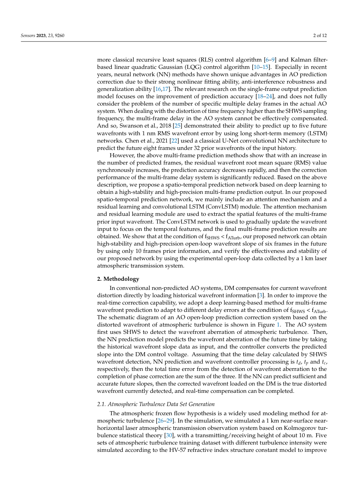
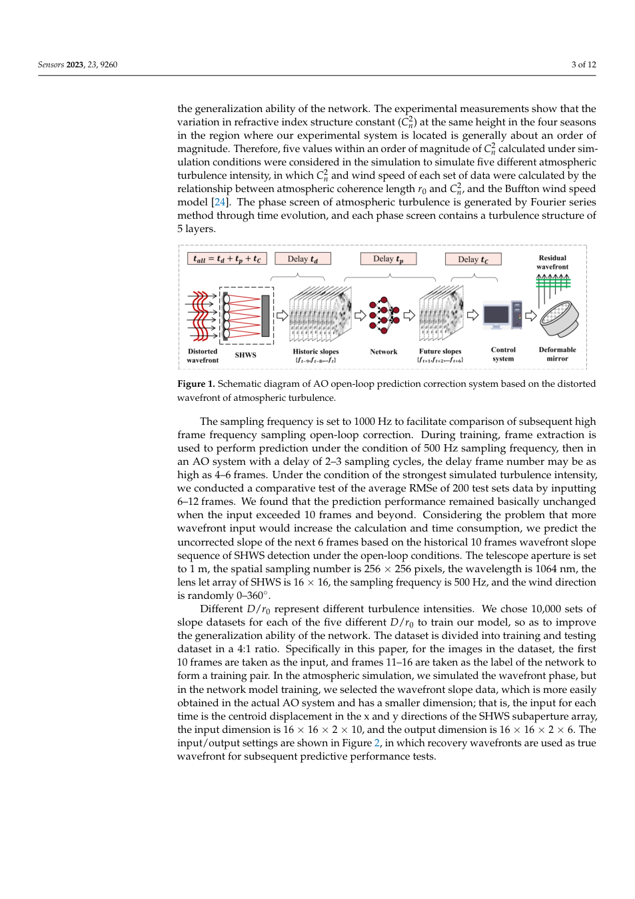
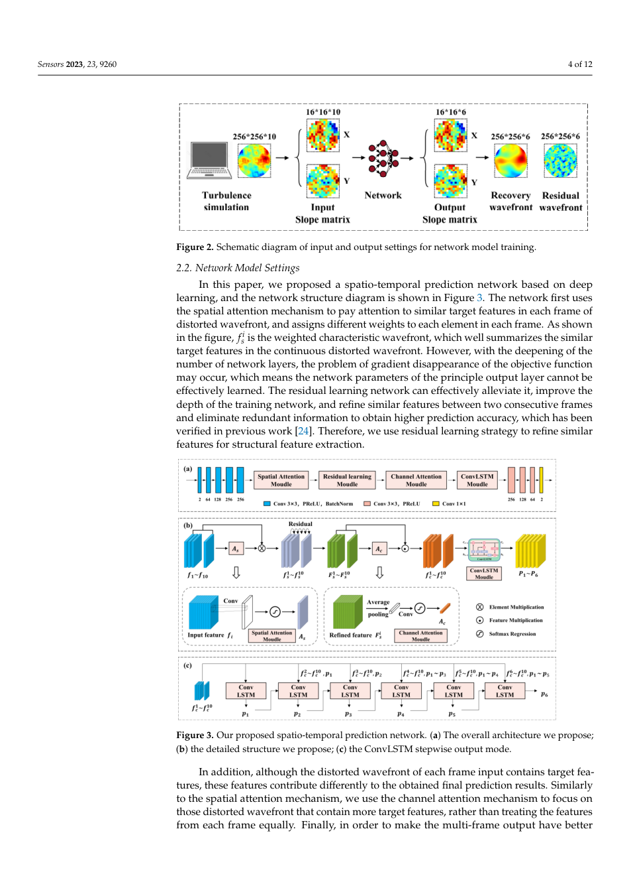
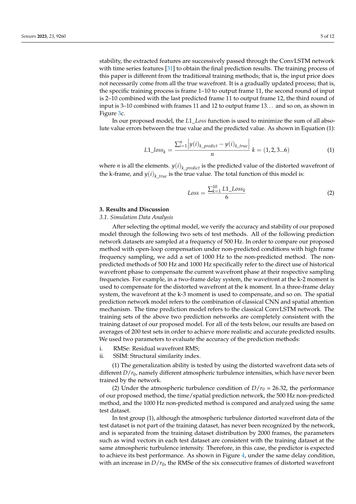
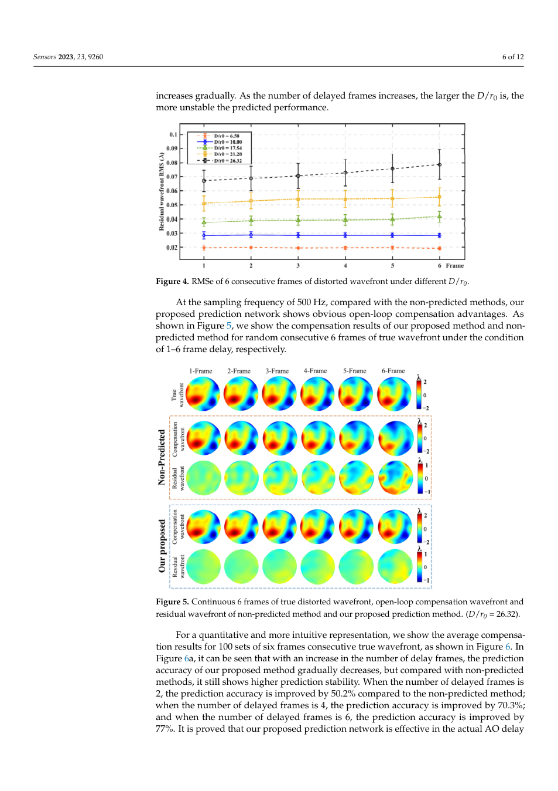
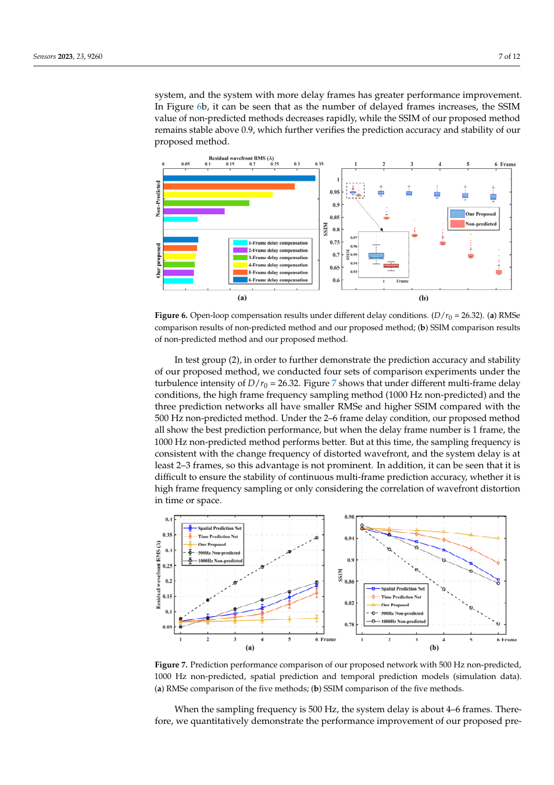
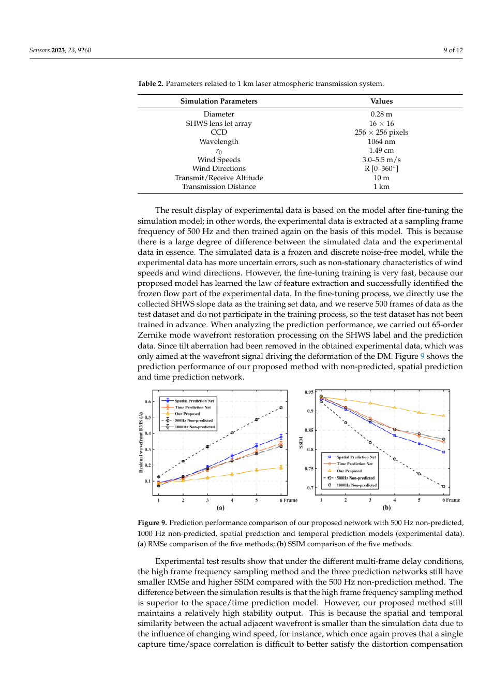
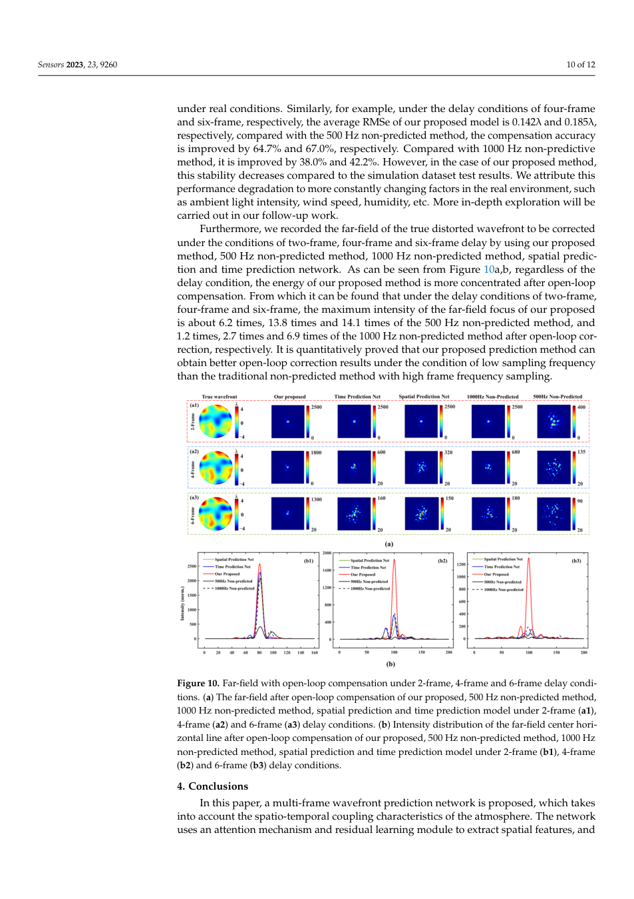
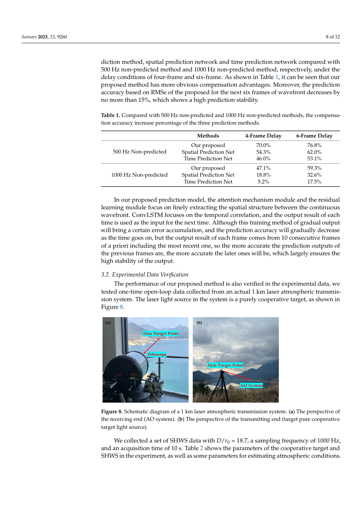

---
title: "Highly Stable Spatio-Temporal Prediction Network of Wavefront Sensor Slopes in Adaptive Optics"
title_zh: "自适应光学中波前传感器斜率的高稳定时空预测网络"
authors:
  - "Ning Wang"
  - "Licheng Zhu"
  - "Qiang Yuan"
  - "Xinlan Ge"
  - "Zeyu Gao"
  - "Shuai Wang"
  - "Ping Yang"
year: "2023"
venue: "Sensors 23:9260"
doi: "10.3390/s23229260"
tags:
  - literature
  - method/deep-learning
  - optics/control
  - optics/adaptive-optics
  - task/wavefront-prediction
methods:
  - deep-learning
  - optical-control
material_system: "自适应光学，时空预测，ConvLSTM，注意力机制"
task_type: "预测多帧延迟条件下的波前传感器斜率并改善 AO 开环补偿"
reading_status: "processed"
source_pdf: "source/2023-Wang-spatio-temporal-wavefront-prediction-AO.pdf"
created: "2026-06-04"
---

# Highly Stable Spatio-Temporal Prediction Network of Wavefront Sensor Slopes in Adaptive Optics

## 0. 文献元信息

### 0.1 基础信息

| 项目 | 内容 |
|---|---|
| 英文题名 | Highly Stable Spatio-Temporal Prediction Network of Wavefront Sensor Slopes in Adaptive Optics |
| 中文题名 | 自适应光学中波前传感器斜率的高稳定时空预测网络 |
| 作者 | Ning Wang, Licheng Zhu, Qiang Yuan, Xinlan Ge, Zeyu Gao, Shuai Wang, Ping Yang |
| 年份/来源 | 2023，Sensors 23:9260 |
| DOI | 10.3390/s23229260 |
| 任务类型 | 预测多帧延迟条件下的波前传感器斜率并改善 AO 开环补偿 |
| 研究对象 | 自适应光学，时空预测，ConvLSTM，注意力机制 |

### 0.2 Abstract 中英文对照

> 合规短摘：: Adaptive Optics (AO) technology is an effective means to compensate for wavefront distortion, but its inherent delay error will cause the compensation wavefront on the deformable

**中文专业转述：**  
这篇论文围绕 自适应光学，时空预测，ConvLSTM，注意力机制 中的核心控制难题展开。本文提出融合空间注意力、通道注意力和 ConvLSTM 的时空预测网络，用连续畸变波前预测未来多帧波前斜率，目标是减小 AO 系统多帧延迟导致的开环补偿误差。 方法上，网络先用空间注意力突出每帧关键区域，再用通道注意力选择更有贡献的历史帧，最后用 ConvLSTM 建模时间演化；作者在仿真和 1 km 激光大气传输实验数据上验证。 结果层面，在 2、4、6 帧延迟下，模型均优于非预测方法；论文报告 4 帧和 6 帧延迟时提升尤其明显，并在仿真与实验远场指标中表现出较高稳定性。

### 0.3 Conclusion 中英文对照

> 合规短摘：In this paper, a multi-frame wavefront prediction network is proposed, which takes into account the spatio-temporal coupling characteristics of the atmosphere. The network uses an 

**中文专业转述：**  
作者最终强调：在 2、4、6 帧延迟下，模型均优于非预测方法；论文报告 4 帧和 6 帧延迟时提升尤其明显，并在仿真与实验远场指标中表现出较高稳定性。 同时，论文也留下了明确边界：模型依赖特定采样频率、湍流强度和训练数据范围；真实部署时需要关注传感器噪声、实时计算和跨场景泛化。

## 1. 快速总结表

| 模块 | 内容 |
|---|---|
| 文章信息 | 2023；Sensors 23:9260；Ning Wang 等 |
| 研究背景 | 光学控制系统中，相位或波前状态随时间变化，而传感、计算和执行存在延迟或不可直接观测的问题。 |
| 研究目的 | 预测多帧延迟条件下的波前传感器斜率并改善 AO 开环补偿 |
| 核心方法 | 网络先用空间注意力突出每帧关键区域，再用通道注意力选择更有贡献的历史帧，最后用 ConvLSTM 建模时间演化；作者在仿真和 1 km 激光大气传输实验数据上验证。 |
| 关键结果 | 在 2、4、6 帧延迟下，模型均优于非预测方法；论文报告 4 帧和 6 帧延迟时提升尤其明显，并在仿真与实验远场指标中表现出较高稳定性。 |
| 主要结论 | 本文提出融合空间注意力、通道注意力和 ConvLSTM 的时空预测网络，用连续畸变波前预测未来多帧波前斜率，目标是减小 AO 系统多帧延迟导致的开环补偿误差。 |
| 文章好在哪里 | 它把深度学习放进具体物理控制链路，而不是只做通用图像识别；同时用指标、流程图和鲁棒性实验支持论证。 |
| 是否值得深读 | 值得，尤其适合做 CBC/AO 中“AI 预测 + 实时控制 + 物理约束”方向的文献基础。 |

## 2. 125 笔记整理表

| 类型 | 内容 | 对我研究/写作的用法 |
|---|---|---|
| 1 个思路 | 用神经网络从可观测图像或斜率序列中预测不可直接及时获得的控制变量。 | 可作为 CBC 相位控制、AO 延迟补偿、光场闭环控制的共同范式。 |
| 2 个图表 1 | 系统/数据流图展示从传感到模型再到控制的链路。 | 写方法章节时先画闭环，再讲模型。 |
| 2 个图表 2 | 性能对比图或表格展示预测方法相对非预测/传统方法的改善。 | 写结果章节时用“基线-模型-理想状态”三层对照。 |
| 5 个句式 1 | The observable intensity/slope pattern is treated as a proxy for the hidden control state. | 用于引出代理观测反演。 |
| 5 个句式 2 | The model reduces latency-induced error by predicting the future state before actuation. | 用于 AO 或实时控制论文。 |
| 5 个句式 3 | Performance must be evaluated at the downstream optical-control level, not only at prediction-error level. | 强调任务指标。 |
| 5 个句式 4 | Robustness is tested by varying noise, turbulence, delay, or array scale. | 写鲁棒性实验设计。 |
| 5 个句式 5 | The method is promising, but deployment depends on hardware timing and distribution shift. | 写局限与展望。 |

## 3. 图表证据链

### Figure 1. Figure 1. Schematic diagram of AO open-loop prediction correction system based on the distorted wavefront of atmospheric turbulence. The sampling frequency is set to 1000 Hz to facilitate comparison of subsequent high frame frequency sampling open-loop correction. During training, frame extraction is used to perform prediction under the condition of 500 Hz sampling frequency, then in

| 维度 | 解析 |
|---|---|
| 目的 | 展示本文证据链中的 Figure 1。批量抽取时保存为页面级截图，优先保证上下文不丢失。 |
| 描述 | Figure 1. Schematic diagram of AO open-loop prediction correction system based on the distorted wavefront of atmospheric turbulence. The sampling frequency is set to 1000 Hz to facilitate comparison of subsequent high frame frequency sampling open-loop correction. During training, frame extraction is used to perform prediction under the condition of 500 Hz sampling frequency, then in |
| 结论 | 该图/表服务于论文主线：本文提出融合空间注意力、通道注意力和 ConvLSTM 的时空预测网络，用连续畸变波前预测未来多帧波前斜率，目标是减小 AO 系统多帧延迟导致的开环补偿误差。 |
| 支撑 | 它把方法、数据或结果中的一个环节可视化，帮助判断模型是否真正改善了相位或波前控制。 |
| 可复用性 | 可作为未来写作中“系统流程、模型结构、性能对比或鲁棒性验证”的图表组织参考。 |
### Figure 2. Figure 2. Schematic diagram of input and output settings for network model training. 2.2. Network Model Settings In this paper, we proposed a spatio-temporal prediction network based on deep learning, and the network structure diagram is shown in Figure 3. The network first uses the spatial attention mechanism to pay attention to similar target features in each frame of

| 维度 | 解析 |
|---|---|
| 目的 | 展示本文证据链中的 Figure 2。批量抽取时保存为页面级截图，优先保证上下文不丢失。 |
| 描述 | Figure 2. Schematic diagram of input and output settings for network model training. 2.2. Network Model Settings In this paper, we proposed a spatio-temporal prediction network based on deep learning, and the network structure diagram is shown in Figure 3. The network first uses the spatial attention mechanism to pay attention to similar target features in each frame of |
| 结论 | 该图/表服务于论文主线：本文提出融合空间注意力、通道注意力和 ConvLSTM 的时空预测网络，用连续畸变波前预测未来多帧波前斜率，目标是减小 AO 系统多帧延迟导致的开环补偿误差。 |
| 支撑 | 它把方法、数据或结果中的一个环节可视化，帮助判断模型是否真正改善了相位或波前控制。 |
| 可复用性 | 可作为未来写作中“系统流程、模型结构、性能对比或鲁棒性验证”的图表组织参考。 |
### Figure 3. Figure 3. Our proposed spatio-temporal prediction network. (a) The overall architecture we propose; (b) the detailed structure we propose; (c) the ConvLSTM stepwise output mode. In addition, although the distorted wavefront of each frame input contains target fea- tures, these features contribute differently to the obtained final prediction results. Similarly to the spatial attention mechanism, we use the channel attention mechanism to focus on

| 维度 | 解析 |
|---|---|
| 目的 | 展示本文证据链中的 Figure 3。批量抽取时保存为页面级截图，优先保证上下文不丢失。 |
| 描述 | Figure 3. Our proposed spatio-temporal prediction network. (a) The overall architecture we propose; (b) the detailed structure we propose; (c) the ConvLSTM stepwise output mode. In addition, although the distorted wavefront of each frame input contains target fea- tures, these features contribute differently to the obtained final prediction results. Similarly to the spatial attention mechanism, we use the channel attention mechanism to focus on |
| 结论 | 该图/表服务于论文主线：本文提出融合空间注意力、通道注意力和 ConvLSTM 的时空预测网络，用连续畸变波前预测未来多帧波前斜率，目标是减小 AO 系统多帧延迟导致的开环补偿误差。 |
| 支撑 | 它把方法、数据或结果中的一个环节可视化，帮助判断模型是否真正改善了相位或波前控制。 |
| 可复用性 | 可作为未来写作中“系统流程、模型结构、性能对比或鲁棒性验证”的图表组织参考。 |
### Figure 4. Figure 4. RMSe of 6 consecutive frames of distorted wavefront under different D/r0. At the sampling frequency of 500 Hz, compared with the non-predicted methods, our proposed prediction network shows obvious open-loop compensation advantages. As shown in Figure 5, we show the compensation results of our proposed method and non- predicted method for random consecutive 6 frames of true wavefront under the condition

| 维度 | 解析 |
|---|---|
| 目的 | 展示本文证据链中的 Figure 4。批量抽取时保存为页面级截图，优先保证上下文不丢失。 |
| 描述 | Figure 4. RMSe of 6 consecutive frames of distorted wavefront under different D/r0. At the sampling frequency of 500 Hz, compared with the non-predicted methods, our proposed prediction network shows obvious open-loop compensation advantages. As shown in Figure 5, we show the compensation results of our proposed method and non- predicted method for random consecutive 6 frames of true wavefront under the condition |
| 结论 | 该图/表服务于论文主线：本文提出融合空间注意力、通道注意力和 ConvLSTM 的时空预测网络，用连续畸变波前预测未来多帧波前斜率，目标是减小 AO 系统多帧延迟导致的开环补偿误差。 |
| 支撑 | 它把方法、数据或结果中的一个环节可视化，帮助判断模型是否真正改善了相位或波前控制。 |
| 可复用性 | 可作为未来写作中“系统流程、模型结构、性能对比或鲁棒性验证”的图表组织参考。 |
### Figure 5. Figure 5. Continuous 6 frames of true distorted wavefront, open-loop compensation wavefront and residual wavefront of non-predicted method and our proposed prediction method. (D/r0 = 26.32). For a quantitative and more intuitive representation, we show the average compensa- tion results for 100 sets of six frames consecutive true wavefront, as shown in Figure 6. In Figure 6a, it can be seen that with an increase in the number of delay frames, the prediction

| 维度 | 解析 |
|---|---|
| 目的 | 展示本文证据链中的 Figure 5。批量抽取时保存为页面级截图，优先保证上下文不丢失。 |
| 描述 | Figure 5. Continuous 6 frames of true distorted wavefront, open-loop compensation wavefront and residual wavefront of non-predicted method and our proposed prediction method. (D/r0 = 26.32). For a quantitative and more intuitive representation, we show the average compensa- tion results for 100 sets of six frames consecutive true wavefront, as shown in Figure 6. In Figure 6a, it can be seen that with an increase in the number of delay frames, the prediction |
| 结论 | 该图/表服务于论文主线：本文提出融合空间注意力、通道注意力和 ConvLSTM 的时空预测网络，用连续畸变波前预测未来多帧波前斜率，目标是减小 AO 系统多帧延迟导致的开环补偿误差。 |
| 支撑 | 它把方法、数据或结果中的一个环节可视化，帮助判断模型是否真正改善了相位或波前控制。 |
| 可复用性 | 可作为未来写作中“系统流程、模型结构、性能对比或鲁棒性验证”的图表组织参考。 |
### Figure 6. Figure 6. Open-loop compensation results under different delay conditions. (D/r0 = 26.32). (a) RMSe comparison results of non-predicted method and our proposed method; (b) SSIM comparison results of non-predicted method and our proposed method. In test group (2), in order to further demonstrate the prediction accuracy and stability of our proposed method, we conducted four sets of comparison experiments under the

| 维度 | 解析 |
|---|---|
| 目的 | 展示本文证据链中的 Figure 6。批量抽取时保存为页面级截图，优先保证上下文不丢失。 |
| 描述 | Figure 6. Open-loop compensation results under different delay conditions. (D/r0 = 26.32). (a) RMSe comparison results of non-predicted method and our proposed method; (b) SSIM comparison results of non-predicted method and our proposed method. In test group (2), in order to further demonstrate the prediction accuracy and stability of our proposed method, we conducted four sets of comparison experiments under the |
| 结论 | 该图/表服务于论文主线：本文提出融合空间注意力、通道注意力和 ConvLSTM 的时空预测网络，用连续畸变波前预测未来多帧波前斜率，目标是减小 AO 系统多帧延迟导致的开环补偿误差。 |
| 支撑 | 它把方法、数据或结果中的一个环节可视化，帮助判断模型是否真正改善了相位或波前控制。 |
| 可复用性 | 可作为未来写作中“系统流程、模型结构、性能对比或鲁棒性验证”的图表组织参考。 |
### Figure 7. Figure 7. Prediction performance comparison of our proposed network with 500 Hz non-predicted, 1000 Hz non-predicted, spatial prediction and temporal prediction models (simulation data). (a) RMSe comparison of the five methods; (b) SSIM comparison of the five methods. When the sampling frequency is 500 Hz, the system delay is about 4–6 frames. There- fore, we quantitatively demonstrate the performance improvement of our proposed pre-

| 维度 | 解析 |
|---|---|
| 目的 | 展示本文证据链中的 Figure 7。批量抽取时保存为页面级截图，优先保证上下文不丢失。 |
| 描述 | Figure 7. Prediction performance comparison of our proposed network with 500 Hz non-predicted, 1000 Hz non-predicted, spatial prediction and temporal prediction models (simulation data). (a) RMSe comparison of the five methods; (b) SSIM comparison of the five methods. When the sampling frequency is 500 Hz, the system delay is about 4–6 frames. There- fore, we quantitatively demonstrate the performance improvement of our proposed pre- |
| 结论 | 该图/表服务于论文主线：本文提出融合空间注意力、通道注意力和 ConvLSTM 的时空预测网络，用连续畸变波前预测未来多帧波前斜率，目标是减小 AO 系统多帧延迟导致的开环补偿误差。 |
| 支撑 | 它把方法、数据或结果中的一个环节可视化，帮助判断模型是否真正改善了相位或波前控制。 |
| 可复用性 | 可作为未来写作中“系统流程、模型结构、性能对比或鲁棒性验证”的图表组织参考。 |
### Figure 8. Figure 8.

| 维度 | 解析 |
|---|---|
| 目的 | 展示本文证据链中的 Figure 8。批量抽取时保存为页面级截图，优先保证上下文不丢失。 |
| 描述 | Figure 8. |
| 结论 | 该图/表服务于论文主线：本文提出融合空间注意力、通道注意力和 ConvLSTM 的时空预测网络，用连续畸变波前预测未来多帧波前斜率，目标是减小 AO 系统多帧延迟导致的开环补偿误差。 |
| 支撑 | 它把方法、数据或结果中的一个环节可视化，帮助判断模型是否真正改善了相位或波前控制。 |
| 可复用性 | 可作为未来写作中“系统流程、模型结构、性能对比或鲁棒性验证”的图表组织参考。 |
### Figure 9. Figure 9. Prediction performance comparison of our proposed network with 500 Hz non-predicted, 1000 Hz non-predicted, spatial prediction and temporal prediction models (experimental data). (a) RMSe comparison of the five methods; (b) SSIM comparison of the five methods. Experimental test results show that under the different multi-frame delay conditions, the high frame frequency sampling method and the three prediction networks still have

| 维度 | 解析 |
|---|---|
| 目的 | 展示本文证据链中的 Figure 9。批量抽取时保存为页面级截图，优先保证上下文不丢失。 |
| 描述 | Figure 9. Prediction performance comparison of our proposed network with 500 Hz non-predicted, 1000 Hz non-predicted, spatial prediction and temporal prediction models (experimental data). (a) RMSe comparison of the five methods; (b) SSIM comparison of the five methods. Experimental test results show that under the different multi-frame delay conditions, the high frame frequency sampling method and the three prediction networks still have |
| 结论 | 该图/表服务于论文主线：本文提出融合空间注意力、通道注意力和 ConvLSTM 的时空预测网络，用连续畸变波前预测未来多帧波前斜率，目标是减小 AO 系统多帧延迟导致的开环补偿误差。 |
| 支撑 | 它把方法、数据或结果中的一个环节可视化，帮助判断模型是否真正改善了相位或波前控制。 |
| 可复用性 | 可作为未来写作中“系统流程、模型结构、性能对比或鲁棒性验证”的图表组织参考。 |
### Figure 10. Figure 10. Far-field with open-loop compensation under 2-frame, 4-frame and 6-frame delay condi- tions. (a) The far-field after open-loop compensation of our proposed, 500 Hz non-predicted method, 1000 Hz non-predicted method, spatial prediction and time prediction model under 2-frame (a1), 4-frame (a2) and 6-frame (a3) delay conditions. (b) Intensity distribution of the far-field center hori- zontal line after open-loop compensation of our proposed, 500 Hz non-predicted method, 1000 Hz

| 维度 | 解析 |
|---|---|
| 目的 | 展示本文证据链中的 Figure 10。批量抽取时保存为页面级截图，优先保证上下文不丢失。 |
| 描述 | Figure 10. Far-field with open-loop compensation under 2-frame, 4-frame and 6-frame delay condi- tions. (a) The far-field after open-loop compensation of our proposed, 500 Hz non-predicted method, 1000 Hz non-predicted method, spatial prediction and time prediction model under 2-frame (a1), 4-frame (a2) and 6-frame (a3) delay conditions. (b) Intensity distribution of the far-field center hori- zontal line after open-loop compensation of our proposed, 500 Hz non-predicted method, 1000 Hz |
| 结论 | 该图/表服务于论文主线：本文提出融合空间注意力、通道注意力和 ConvLSTM 的时空预测网络，用连续畸变波前预测未来多帧波前斜率，目标是减小 AO 系统多帧延迟导致的开环补偿误差。 |
| 支撑 | 它把方法、数据或结果中的一个环节可视化，帮助判断模型是否真正改善了相位或波前控制。 |
| 可复用性 | 可作为未来写作中“系统流程、模型结构、性能对比或鲁棒性验证”的图表组织参考。 |
### Table 1. Table 1. Compared with 500 Hz non-predicted and 1000 Hz non-predicted methods, the compensa- tion accuracy increase percentage of the three prediction methods. Methods 4-Frame Delay 6-Frame Delay

| 维度 | 解析 |
|---|---|
| 目的 | 展示本文证据链中的 Table 1。批量抽取时保存为页面级截图，优先保证上下文不丢失。 |
| 描述 | Table 1. Compared with 500 Hz non-predicted and 1000 Hz non-predicted methods, the compensa- tion accuracy increase percentage of the three prediction methods. Methods 4-Frame Delay 6-Frame Delay |
| 结论 | 该图/表服务于论文主线：本文提出融合空间注意力、通道注意力和 ConvLSTM 的时空预测网络，用连续畸变波前预测未来多帧波前斜率，目标是减小 AO 系统多帧延迟导致的开环补偿误差。 |
| 支撑 | 它把方法、数据或结果中的一个环节可视化，帮助判断模型是否真正改善了相位或波前控制。 |
| 可复用性 | 可作为未来写作中“系统流程、模型结构、性能对比或鲁棒性验证”的图表组织参考。 |
### Table 2. Table 2. Parameters related to 1 km laser atmospheric transmission system. Simulation Parameters Values Diameter 0.28 m

| 维度 | 解析 |
|---|---|
| 目的 | 展示本文证据链中的 Table 2。批量抽取时保存为页面级截图，优先保证上下文不丢失。 |
| 描述 | Table 2. Parameters related to 1 km laser atmospheric transmission system. Simulation Parameters Values Diameter 0.28 m |
| 结论 | 该图/表服务于论文主线：本文提出融合空间注意力、通道注意力和 ConvLSTM 的时空预测网络，用连续畸变波前预测未来多帧波前斜率，目标是减小 AO 系统多帧延迟导致的开环补偿误差。 |
| 支撑 | 它把方法、数据或结果中的一个环节可视化，帮助判断模型是否真正改善了相位或波前控制。 |
| 可复用性 | 可作为未来写作中“系统流程、模型结构、性能对比或鲁棒性验证”的图表组织参考。 |

## 4. 方法与图表复用

这篇论文最值得复用的是“物理系统问题定义 → 可观测代理信号 → 神经网络预测 → 控制补偿 → 下游光学指标验证”的写作路径。对于 CBC 论文，重点看相位误差如何被预测并转化为补偿；对于 AO 论文，重点看延迟波前如何被预测并转化为残差下降。

## 5. 中英陪读

| 关键词 | 中文解释 |
|---|---|
| coherent beam combining | 相干光束合成，通过控制多路光束相位使其叠加成高质量输出。 |
| adaptive optics | 自适应光学，通过实时测量和校正波前畸变改善成像或传输质量。 |
| wavefront prediction | 波前预测，用历史观测估计未来波前以补偿控制延迟。 |
| phase control | 相位控制，使不同通道保持目标相位关系。 |
| open-loop correction | 开环校正，控制量不直接依赖校正后的即时反馈，因而更依赖预测准确性。 |

## 6. Daedalus 深度剖析

### Act I: Opening Gambit - 核心价值命题

本文提出融合空间注意力、通道注意力和 ConvLSTM 的时空预测网络，用连续畸变波前预测未来多帧波前斜率，目标是减小 AO 系统多帧延迟导致的开环补偿误差。 这类论文的战略意义在于，它把光学系统中的“慢反馈”和“不可观测隐变量”问题，转化为机器学习可以处理的预测或反演问题。

### Act II: Narrative Unfolding - 从真实工程到科学核心

真实工程痛点是：光学系统并不会等控制器慢慢计算。CBC 中相位噪声会持续漂移；AO 中大气湍流会在传感、计算和变形镜响应之间继续演化。因此，系统需要提前知道或快速反推出下一步该如何补偿。

### Act III: Technical Heart - 方法核心

网络先用空间注意力突出每帧关键区域，再用通道注意力选择更有贡献的历史帧，最后用 ConvLSTM 建模时间演化；作者在仿真和 1 km 激光大气传输实验数据上验证。 技术上最重要的是输入输出定义：输入不是抽象向量，而是带有物理含义的强度图、波前斜率或时间序列；输出也不是普通分类标签，而是相位、波前或补偿相关的连续控制量。

### Act IV: Chain Of Evidence - 结果证据链

本文图表从系统结构、模型结构、训练/测试设置、性能比较和鲁棒性分析几个层面组织证据。`## 3` 中列出的每个图表都对应证据链的一环：先证明系统和数据可信，再证明模型有效，最后证明方法在噪声、延迟、规模或目标变化下仍有边界内的稳定性。

### Act V: Intellectual Distillation - 页外洞察

关键洞察是：深度学习在这里不是替代物理，而是学习物理系统中难以显式建模或难以及时测量的映射。它的成功依赖训练分布覆盖、传感链路稳定、输出变量定义合理，以及评价指标真正对应光学任务。

### Act VI: Legacy And Outlook - 迁移与未来方向

未来可以沿三条线推进：第一，把模型部署到更真实的硬件闭环中，测量端到端延迟；第二，用物理约束或仿真-实验混合数据提升泛化；第三，面向更大阵列、更强湍流或更复杂目标光场做规模化验证。

## 7. 写作素材库

| 用途 | 可复用表达 |
|---|---|
| 引出问题 | 光学控制的关键瓶颈不是缺少测量，而是测量、推理和执行之间存在时间差与隐变量。 |
| 方法表述 | 将可观测光场图样或 WFS slope 序列作为隐藏相位/波前状态的代理信号。 |
| 结果表述 | 方法的价值应通过最终光学质量指标验证，而不仅是网络预测误差。 |
| 局限表述 | 部署性能取决于硬件延迟、训练分布、噪声模型和跨场景泛化能力。 |

## 8. 局限与复核清单

| 项目 | 状态 |
|---|---|
| PDF 文本抽取 | PyMuPDF 抽取成功，共 12 页。 |
| 图表抽取 | 已保存 10 张 Figure 页面截图、2 张 Table 页面截图。 |
| 抽取精度 | 批量模式采用页面级截图，可靠保留上下文，但不是所有图表都做了精确裁剪。 |
| Abstract/Conclusion | 因版权合规限制，仅放短摘和中文专业转述。 |
| 需人工复核 | 建议打开 Typora 检查页面截图是否需要后续手工裁剪成更精确的图。 |

## 本论文的通用知识迁移总结

- **核心思想**：把光学系统中的不可见或未来状态转化为可学习的预测/反演任务。
- **可复用模块**：代理观测、深度学习预测器、闭环补偿、鲁棒性扫描、下游光学指标验证。
- **关键避坑指南**：不要只报告模型误差；一定要说明硬件时延、噪声、训练分布和物理可达性边界。
