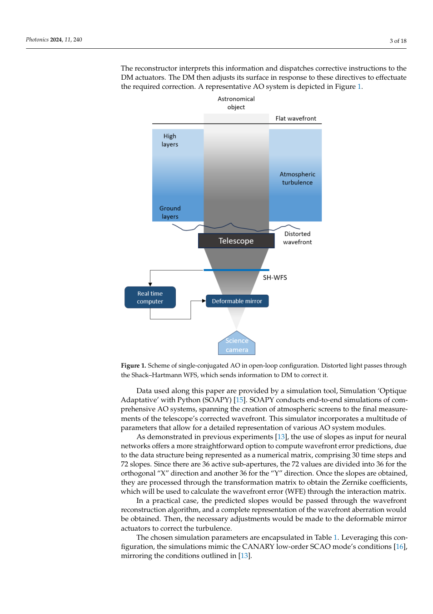
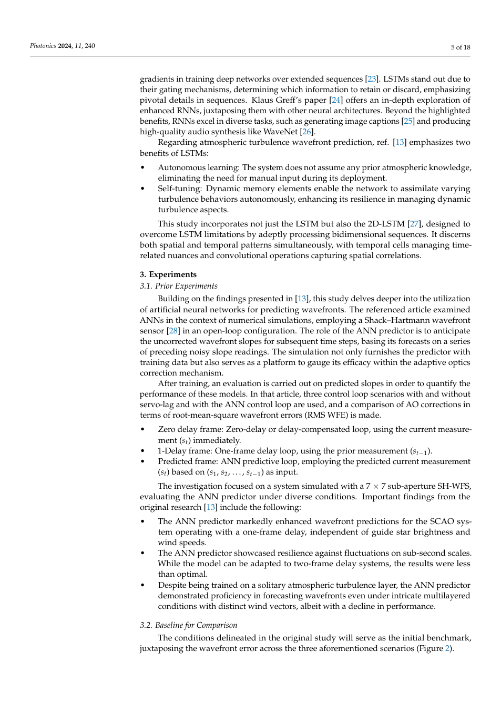
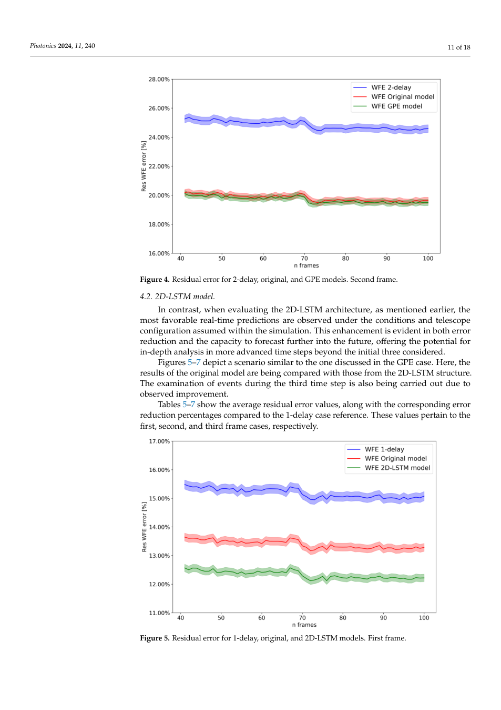
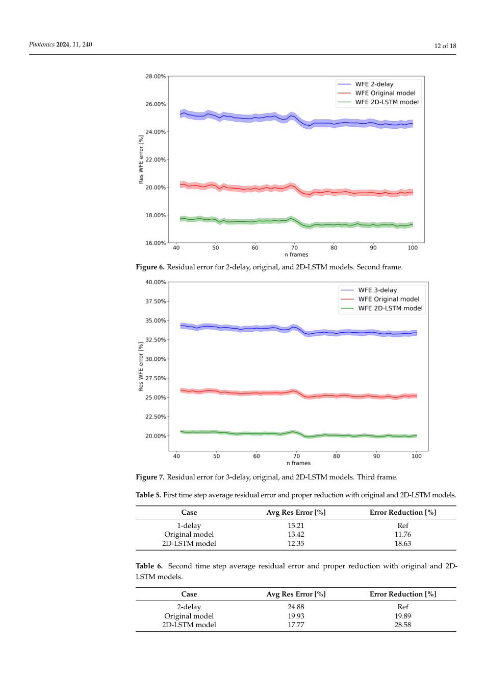
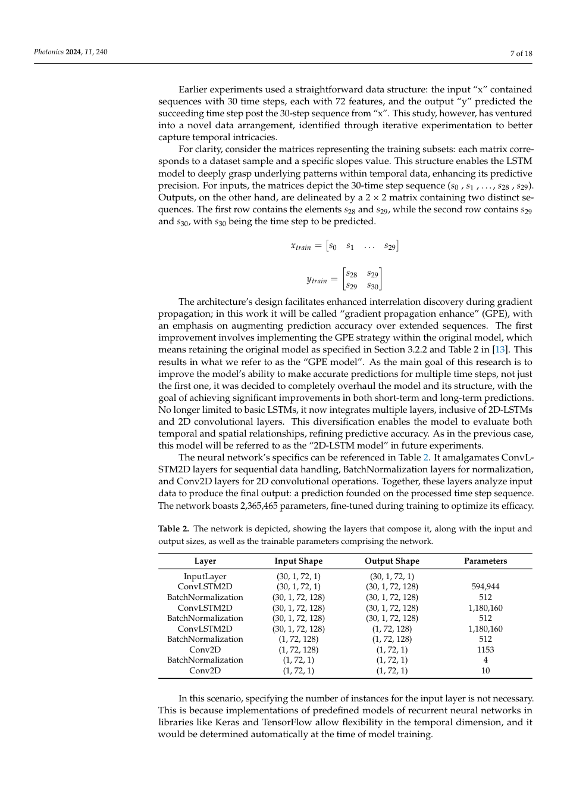
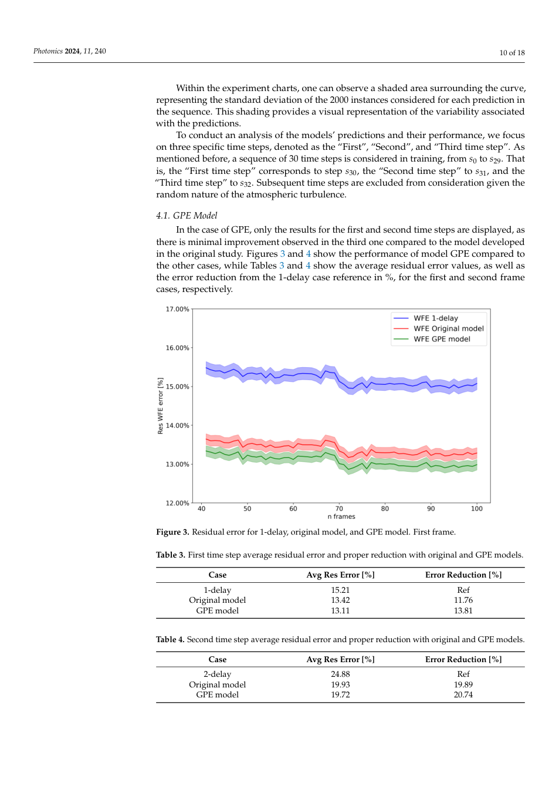
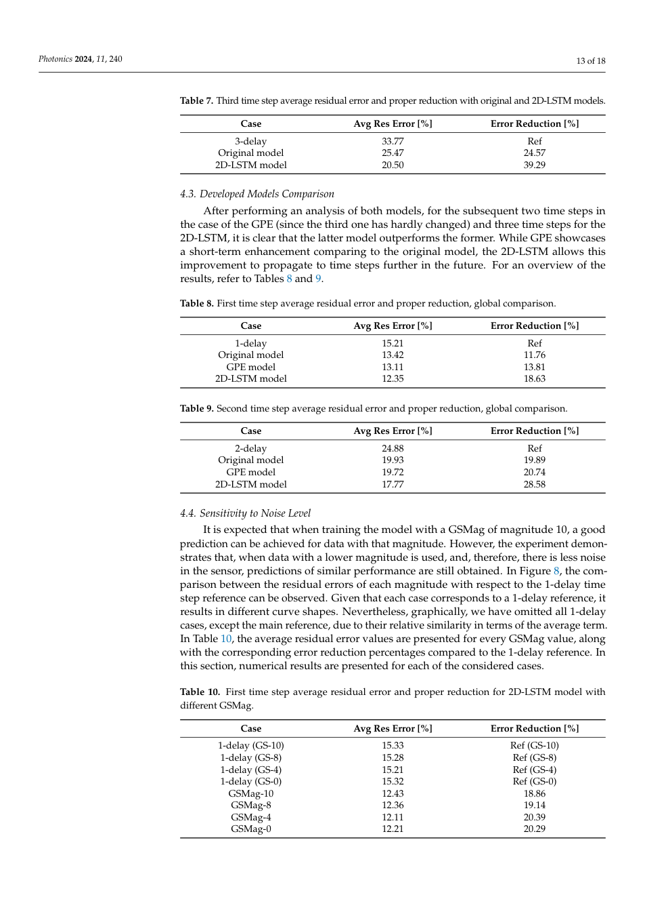
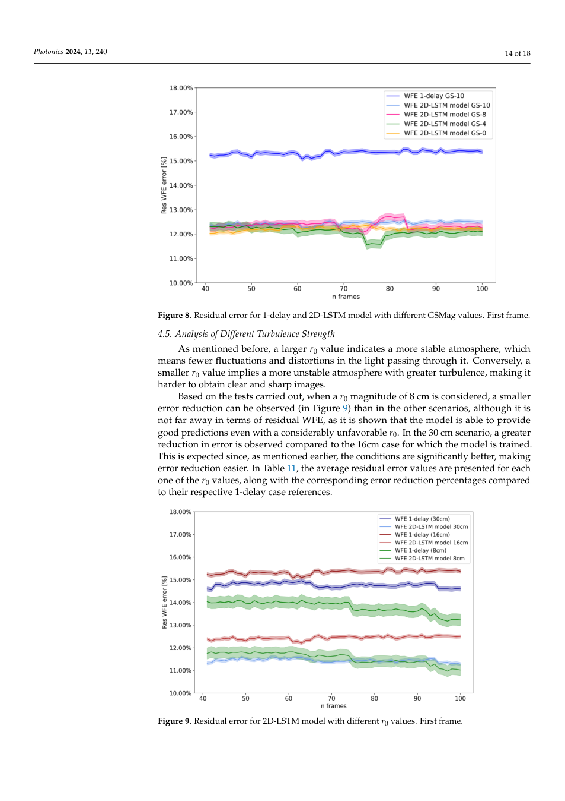
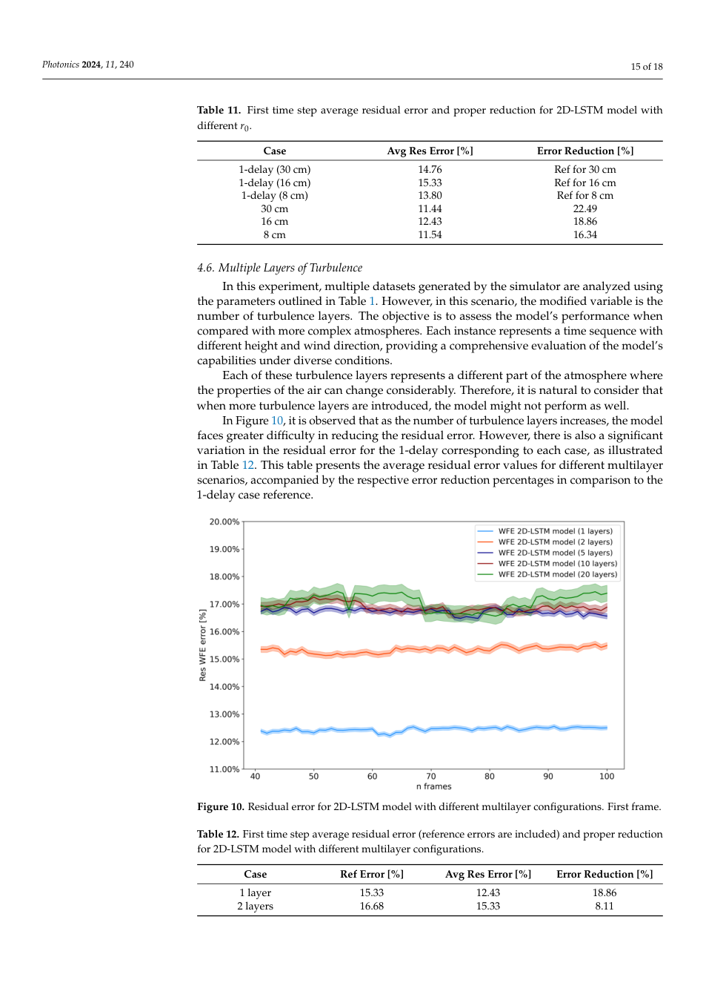

---
title: "Enhancing Open-Loop Wavefront Prediction in Adaptive Optics through 2D-LSTM Neural Network Implementation"
title_zh: "通过 2D-LSTM 神经网络提升自适应光学开环波前预测"
authors:
  - "Saúl Pérez"
  - "Alejandro Buendía"
  - "Carlos González"
  - "Javier Rodríguez"
  - "Santiago Iglesias"
  - "Julia Fernández"
  - "Francisco Javier De Cos"
year: "2024"
venue: "Photonics 11:240"
doi: "10.3390/photonics11030240"
tags:
  - literature
  - method/deep-learning
  - optics/control
  - optics/adaptive-optics
  - task/wavefront-prediction
methods:
  - deep-learning
  - optical-control
material_system: "自适应光学，2D-LSTM，开环波前预测"
task_type: "在模拟 SCAO 中进行多步开环波前预测"
reading_status: "processed"
source_pdf: "source/2024-Perez-2D-LSTM-open-loop-wavefront-prediction-AO.pdf"
created: "2026-06-04"
---

# Enhancing Open-Loop Wavefront Prediction in Adaptive Optics through 2D-LSTM Neural Network Implementation

## 0. 文献元信息

### 0.1 基础信息

| 项目 | 内容 |
|---|---|
| 英文题名 | Enhancing Open-Loop Wavefront Prediction in Adaptive Optics through 2D-LSTM Neural Network Implementation |
| 中文题名 | 通过 2D-LSTM 神经网络提升自适应光学开环波前预测 |
| 作者 | Saúl Pérez, Alejandro Buendía, Carlos González, Javier Rodríguez, Santiago Iglesias, Julia Fernández, Francisco Javier De Cos |
| 年份/来源 | 2024，Photonics 11:240 |
| DOI | 10.3390/photonics11030240 |
| 任务类型 | 在模拟 SCAO 中进行多步开环波前预测 |
| 研究对象 | 自适应光学，2D-LSTM，开环波前预测 |

### 0.2 Abstract 中英文对照

> 合规短摘：: Adaptive optics (AO) is a technique with an important role in image correction on ground- based telescopes through the deployment of specific optical instruments and various cont

**中文专业转述：**  
这篇论文围绕 自适应光学，2D-LSTM，开环波前预测 中的核心控制难题展开。本文在 AO 开环波前预测中引入 2D-LSTM，使模型同时利用空间结构和时间演化信息，相比原始 ANN/GPE 模型能更好地预测多步延迟下的波前残差。 方法上，作者基于 Soapy SCAO 仿真数据，对比原始模型、GPE 模型和 2D-LSTM；考察一帧、二帧、三帧预测以及导星星等、湍流强度和多层大气配置变化。 结果层面，2D-LSTM 在多步预测中优于原始模型，尤其能延伸到第二、第三时间步；在噪声和湍流参数偏离最优条件时性能下降但仍处于可接受范围。

### 0.3 Conclusion 中英文对照

> 合规短摘：and Future Lines The research underscores the potential for enhancing adaptive optics wavefront pre- diction models. It reaffirms that with the deployment of sophisticated neural n

**中文专业转述：**  
作者最终强调：2D-LSTM 在多步预测中优于原始模型，尤其能延伸到第二、第三时间步；在噪声和湍流参数偏离最优条件时性能下降但仍处于可接受范围。 同时，论文也留下了明确边界：仿真环境假设较强，真实望远镜 AO 系统中的非平稳大气、硬件延迟和在线更新策略仍需进一步研究。

## 1. 快速总结表

| 模块 | 内容 |
|---|---|
| 文章信息 | 2024；Photonics 11:240；Saúl Pérez 等 |
| 研究背景 | 光学控制系统中，相位或波前状态随时间变化，而传感、计算和执行存在延迟或不可直接观测的问题。 |
| 研究目的 | 在模拟 SCAO 中进行多步开环波前预测 |
| 核心方法 | 作者基于 Soapy SCAO 仿真数据，对比原始模型、GPE 模型和 2D-LSTM；考察一帧、二帧、三帧预测以及导星星等、湍流强度和多层大气配置变化。 |
| 关键结果 | 2D-LSTM 在多步预测中优于原始模型，尤其能延伸到第二、第三时间步；在噪声和湍流参数偏离最优条件时性能下降但仍处于可接受范围。 |
| 主要结论 | 本文在 AO 开环波前预测中引入 2D-LSTM，使模型同时利用空间结构和时间演化信息，相比原始 ANN/GPE 模型能更好地预测多步延迟下的波前残差。 |
| 文章好在哪里 | 它把深度学习放进具体物理控制链路，而不是只做通用图像识别；同时用指标、流程图和鲁棒性实验支持论证。 |
| 是否值得深读 | 值得，尤其适合做 CBC/AO 中“AI 预测 + 实时控制 + 物理约束”方向的文献基础。 |

## 2. 125 笔记整理表

| 类型 | 内容 | 对我研究/写作的用法 |
|---|---|---|
| 1 个思路 | 用神经网络从可观测图像或斜率序列中预测不可直接及时获得的控制变量。 | 可作为 CBC 相位控制、AO 延迟补偿、光场闭环控制的共同范式。 |
| 2 个图表 1 | 系统/数据流图展示从传感到模型再到控制的链路。 | 写方法章节时先画闭环，再讲模型。 |
| 2 个图表 2 | 性能对比图或表格展示预测方法相对非预测/传统方法的改善。 | 写结果章节时用“基线-模型-理想状态”三层对照。 |
| 5 个句式 1 | The observable intensity/slope pattern is treated as a proxy for the hidden control state. | 用于引出代理观测反演。 |
| 5 个句式 2 | The model reduces latency-induced error by predicting the future state before actuation. | 用于 AO 或实时控制论文。 |
| 5 个句式 3 | Performance must be evaluated at the downstream optical-control level, not only at prediction-error level. | 强调任务指标。 |
| 5 个句式 4 | Robustness is tested by varying noise, turbulence, delay, or array scale. | 写鲁棒性实验设计。 |
| 5 个句式 5 | The method is promising, but deployment depends on hardware timing and distribution shift. | 写局限与展望。 |

## 3. 图表证据链

### Figure 1. Figure 1. Scheme of single-conjugated AO in open-loop configuration. Distorted light passes through the Shack–Hartmann WFS, which sends information to DM to correct it. Data used along this paper are provided by a simulation tool, Simulation ‘Optique Adaptative’ with Python (SOAPY) [15]. SOAPY conducts end-to-end simulations of com- prehensive AO systems, spanning the creation of atmospheric screens to the final measure-

| 维度 | 解析 |
|---|---|
| 目的 | 展示本文证据链中的 Figure 1。批量抽取时保存为页面级截图，优先保证上下文不丢失。 |
| 描述 | Figure 1. Scheme of single-conjugated AO in open-loop configuration. Distorted light passes through the Shack–Hartmann WFS, which sends information to DM to correct it. Data used along this paper are provided by a simulation tool, Simulation ‘Optique Adaptative’ with Python (SOAPY) [15]. SOAPY conducts end-to-end simulations of com- prehensive AO systems, spanning the creation of atmospheric screens to the final measure- |
| 结论 | 该图/表服务于论文主线：本文在 AO 开环波前预测中引入 2D-LSTM，使模型同时利用空间结构和时间演化信息，相比原始 ANN/GPE 模型能更好地预测多步延迟下的波前残差。 |
| 支撑 | 它把方法、数据或结果中的一个环节可视化，帮助判断模型是否真正改善了相位或波前控制。 |
| 可复用性 | 可作为未来写作中“系统流程、模型结构、性能对比或鲁棒性验证”的图表组织参考。 |
### Figure 2. Figure 2. Simulated SCAO system and its data flow. Three cases of slopes are considered for calculating wavefront error in experiments. This methodology facilitates a nuanced appraisal of the suggested model’s efficacy within a comparable framework. The objective is to scrutinize how various prediction models fare concerning wavefront error prediction via artificial neural networks. However,

| 维度 | 解析 |
|---|---|
| 目的 | 展示本文证据链中的 Figure 2。批量抽取时保存为页面级截图，优先保证上下文不丢失。 |
| 描述 | Figure 2. Simulated SCAO system and its data flow. Three cases of slopes are considered for calculating wavefront error in experiments. This methodology facilitates a nuanced appraisal of the suggested model’s efficacy within a comparable framework. The objective is to scrutinize how various prediction models fare concerning wavefront error prediction via artificial neural networks. However, |
| 结论 | 该图/表服务于论文主线：本文在 AO 开环波前预测中引入 2D-LSTM，使模型同时利用空间结构和时间演化信息，相比原始 ANN/GPE 模型能更好地预测多步延迟下的波前残差。 |
| 支撑 | 它把方法、数据或结果中的一个环节可视化，帮助判断模型是否真正改善了相位或波前控制。 |
| 可复用性 | 可作为未来写作中“系统流程、模型结构、性能对比或鲁棒性验证”的图表组织参考。 |
### Figure 3. Figure 3. Residual error for 1-delay, original model, and GPE model. First frame.

| 维度 | 解析 |
|---|---|
| 目的 | 展示本文证据链中的 Figure 3。批量抽取时保存为页面级截图，优先保证上下文不丢失。 |
| 描述 | Figure 3. Residual error for 1-delay, original model, and GPE model. First frame. |
| 结论 | 该图/表服务于论文主线：本文在 AO 开环波前预测中引入 2D-LSTM，使模型同时利用空间结构和时间演化信息，相比原始 ANN/GPE 模型能更好地预测多步延迟下的波前残差。 |
| 支撑 | 它把方法、数据或结果中的一个环节可视化，帮助判断模型是否真正改善了相位或波前控制。 |
| 可复用性 | 可作为未来写作中“系统流程、模型结构、性能对比或鲁棒性验证”的图表组织参考。 |
### Figure 4. Figure 4. Residual error for 2-delay, original, and GPE models. Second frame. 4.2. 2D-LSTM model. In contrast, when evaluating the 2D-LSTM architecture, as mentioned earlier, the most favorable real-time predictions are observed under the conditions and telescope configuration assumed within the simulation. This enhancement is evident in both error

| 维度 | 解析 |
|---|---|
| 目的 | 展示本文证据链中的 Figure 4。批量抽取时保存为页面级截图，优先保证上下文不丢失。 |
| 描述 | Figure 4. Residual error for 2-delay, original, and GPE models. Second frame. 4.2. 2D-LSTM model. In contrast, when evaluating the 2D-LSTM architecture, as mentioned earlier, the most favorable real-time predictions are observed under the conditions and telescope configuration assumed within the simulation. This enhancement is evident in both error |
| 结论 | 该图/表服务于论文主线：本文在 AO 开环波前预测中引入 2D-LSTM，使模型同时利用空间结构和时间演化信息，相比原始 ANN/GPE 模型能更好地预测多步延迟下的波前残差。 |
| 支撑 | 它把方法、数据或结果中的一个环节可视化，帮助判断模型是否真正改善了相位或波前控制。 |
| 可复用性 | 可作为未来写作中“系统流程、模型结构、性能对比或鲁棒性验证”的图表组织参考。 |
### Figure 5. Figure 5. Residual error for 1-delay, original, and 2D-LSTM models. First frame. Photonics 2024, 11, 240 12 of 18

| 维度 | 解析 |
|---|---|
| 目的 | 展示本文证据链中的 Figure 5。批量抽取时保存为页面级截图，优先保证上下文不丢失。 |
| 描述 | Figure 5. Residual error for 1-delay, original, and 2D-LSTM models. First frame. Photonics 2024, 11, 240 12 of 18 |
| 结论 | 该图/表服务于论文主线：本文在 AO 开环波前预测中引入 2D-LSTM，使模型同时利用空间结构和时间演化信息，相比原始 ANN/GPE 模型能更好地预测多步延迟下的波前残差。 |
| 支撑 | 它把方法、数据或结果中的一个环节可视化，帮助判断模型是否真正改善了相位或波前控制。 |
| 可复用性 | 可作为未来写作中“系统流程、模型结构、性能对比或鲁棒性验证”的图表组织参考。 |
### Figure 6. Figure 6. Residual error for 2-delay, original, and 2D-LSTM models. Second frame.

| 维度 | 解析 |
|---|---|
| 目的 | 展示本文证据链中的 Figure 6。批量抽取时保存为页面级截图，优先保证上下文不丢失。 |
| 描述 | Figure 6. Residual error for 2-delay, original, and 2D-LSTM models. Second frame. |
| 结论 | 该图/表服务于论文主线：本文在 AO 开环波前预测中引入 2D-LSTM，使模型同时利用空间结构和时间演化信息，相比原始 ANN/GPE 模型能更好地预测多步延迟下的波前残差。 |
| 支撑 | 它把方法、数据或结果中的一个环节可视化，帮助判断模型是否真正改善了相位或波前控制。 |
| 可复用性 | 可作为未来写作中“系统流程、模型结构、性能对比或鲁棒性验证”的图表组织参考。 |
### Figure 7. Figure 7. Residual error for 3-delay, original, and 2D-LSTM models. Third frame.

| 维度 | 解析 |
|---|---|
| 目的 | 展示本文证据链中的 Figure 7。批量抽取时保存为页面级截图，优先保证上下文不丢失。 |
| 描述 | Figure 7. Residual error for 3-delay, original, and 2D-LSTM models. Third frame. |
| 结论 | 该图/表服务于论文主线：本文在 AO 开环波前预测中引入 2D-LSTM，使模型同时利用空间结构和时间演化信息，相比原始 ANN/GPE 模型能更好地预测多步延迟下的波前残差。 |
| 支撑 | 它把方法、数据或结果中的一个环节可视化，帮助判断模型是否真正改善了相位或波前控制。 |
| 可复用性 | 可作为未来写作中“系统流程、模型结构、性能对比或鲁棒性验证”的图表组织参考。 |
### Figure 8. Figure 8. Residual error for 1-delay and 2D-LSTM model with different GSMag values. First frame. 4.5. Analysis of Different Turbulence Strength As mentioned before, a larger r0 value indicates a more stable atmosphere, which means fewer fluctuations and distortions in the light passing through it. Conversely, a smaller r0 value implies a more unstable atmosphere with greater turbulence, making it

| 维度 | 解析 |
|---|---|
| 目的 | 展示本文证据链中的 Figure 8。批量抽取时保存为页面级截图，优先保证上下文不丢失。 |
| 描述 | Figure 8. Residual error for 1-delay and 2D-LSTM model with different GSMag values. First frame. 4.5. Analysis of Different Turbulence Strength As mentioned before, a larger r0 value indicates a more stable atmosphere, which means fewer fluctuations and distortions in the light passing through it. Conversely, a smaller r0 value implies a more unstable atmosphere with greater turbulence, making it |
| 结论 | 该图/表服务于论文主线：本文在 AO 开环波前预测中引入 2D-LSTM，使模型同时利用空间结构和时间演化信息，相比原始 ANN/GPE 模型能更好地预测多步延迟下的波前残差。 |
| 支撑 | 它把方法、数据或结果中的一个环节可视化，帮助判断模型是否真正改善了相位或波前控制。 |
| 可复用性 | 可作为未来写作中“系统流程、模型结构、性能对比或鲁棒性验证”的图表组织参考。 |
### Figure 9. Figure 9. Residual error for 2D-LSTM model with different r0 values. First frame. Photonics 2024, 11, 240 15 of 18

| 维度 | 解析 |
|---|---|
| 目的 | 展示本文证据链中的 Figure 9。批量抽取时保存为页面级截图，优先保证上下文不丢失。 |
| 描述 | Figure 9. Residual error for 2D-LSTM model with different r0 values. First frame. Photonics 2024, 11, 240 15 of 18 |
| 结论 | 该图/表服务于论文主线：本文在 AO 开环波前预测中引入 2D-LSTM，使模型同时利用空间结构和时间演化信息，相比原始 ANN/GPE 模型能更好地预测多步延迟下的波前残差。 |
| 支撑 | 它把方法、数据或结果中的一个环节可视化，帮助判断模型是否真正改善了相位或波前控制。 |
| 可复用性 | 可作为未来写作中“系统流程、模型结构、性能对比或鲁棒性验证”的图表组织参考。 |
### Figure 10. Figure 10. Residual error for 2D-LSTM model with different multilayer configurations. First frame.

| 维度 | 解析 |
|---|---|
| 目的 | 展示本文证据链中的 Figure 10。批量抽取时保存为页面级截图，优先保证上下文不丢失。 |
| 描述 | Figure 10. Residual error for 2D-LSTM model with different multilayer configurations. First frame. |
| 结论 | 该图/表服务于论文主线：本文在 AO 开环波前预测中引入 2D-LSTM，使模型同时利用空间结构和时间演化信息，相比原始 ANN/GPE 模型能更好地预测多步延迟下的波前残差。 |
| 支撑 | 它把方法、数据或结果中的一个环节可视化，帮助判断模型是否真正改善了相位或波前控制。 |
| 可复用性 | 可作为未来写作中“系统流程、模型结构、性能对比或鲁棒性验证”的图表组织参考。 |
### Table 1. Table 1. Main set of parameters for the Soapy SCAO simulation. Unless specified, simulations run with this set of parameters. Module Parameter Value

| 维度 | 解析 |
|---|---|
| 目的 | 展示本文证据链中的 Table 1。批量抽取时保存为页面级截图，优先保证上下文不丢失。 |
| 描述 | Table 1. Main set of parameters for the Soapy SCAO simulation. Unless specified, simulations run with this set of parameters. Module Parameter Value |
| 结论 | 该图/表服务于论文主线：本文在 AO 开环波前预测中引入 2D-LSTM，使模型同时利用空间结构和时间演化信息，相比原始 ANN/GPE 模型能更好地预测多步延迟下的波前残差。 |
| 支撑 | 它把方法、数据或结果中的一个环节可视化，帮助判断模型是否真正改善了相位或波前控制。 |
| 可复用性 | 可作为未来写作中“系统流程、模型结构、性能对比或鲁棒性验证”的图表组织参考。 |
### Table 2. Table 2. The network is depicted, showing the layers that compose it, along with the input and output sizes, as well as the trainable parameters comprising the network. Layer Input Shape Output Shape

| 维度 | 解析 |
|---|---|
| 目的 | 展示本文证据链中的 Table 2。批量抽取时保存为页面级截图，优先保证上下文不丢失。 |
| 描述 | Table 2. The network is depicted, showing the layers that compose it, along with the input and output sizes, as well as the trainable parameters comprising the network. Layer Input Shape Output Shape |
| 结论 | 该图/表服务于论文主线：本文在 AO 开环波前预测中引入 2D-LSTM，使模型同时利用空间结构和时间演化信息，相比原始 ANN/GPE 模型能更好地预测多步延迟下的波前残差。 |
| 支撑 | 它把方法、数据或结果中的一个环节可视化，帮助判断模型是否真正改善了相位或波前控制。 |
| 可复用性 | 可作为未来写作中“系统流程、模型结构、性能对比或鲁棒性验证”的图表组织参考。 |
### Table 3. Table 3. First time step average residual error and proper reduction with original and GPE models. Case Avg Res Error [%] Error Reduction [%] 1-delay

| 维度 | 解析 |
|---|---|
| 目的 | 展示本文证据链中的 Table 3。批量抽取时保存为页面级截图，优先保证上下文不丢失。 |
| 描述 | Table 3. First time step average residual error and proper reduction with original and GPE models. Case Avg Res Error [%] Error Reduction [%] 1-delay |
| 结论 | 该图/表服务于论文主线：本文在 AO 开环波前预测中引入 2D-LSTM，使模型同时利用空间结构和时间演化信息，相比原始 ANN/GPE 模型能更好地预测多步延迟下的波前残差。 |
| 支撑 | 它把方法、数据或结果中的一个环节可视化，帮助判断模型是否真正改善了相位或波前控制。 |
| 可复用性 | 可作为未来写作中“系统流程、模型结构、性能对比或鲁棒性验证”的图表组织参考。 |
### Table 4. Table 4. Second time step average residual error and proper reduction with original and GPE models. Case Avg Res Error [%] Error Reduction [%] 2-delay

| 维度 | 解析 |
|---|---|
| 目的 | 展示本文证据链中的 Table 4。批量抽取时保存为页面级截图，优先保证上下文不丢失。 |
| 描述 | Table 4. Second time step average residual error and proper reduction with original and GPE models. Case Avg Res Error [%] Error Reduction [%] 2-delay |
| 结论 | 该图/表服务于论文主线：本文在 AO 开环波前预测中引入 2D-LSTM，使模型同时利用空间结构和时间演化信息，相比原始 ANN/GPE 模型能更好地预测多步延迟下的波前残差。 |
| 支撑 | 它把方法、数据或结果中的一个环节可视化，帮助判断模型是否真正改善了相位或波前控制。 |
| 可复用性 | 可作为未来写作中“系统流程、模型结构、性能对比或鲁棒性验证”的图表组织参考。 |
### Table 5. Table 5. First time step average residual error and proper reduction with original and 2D-LSTM models. Case Avg Res Error [%] Error Reduction [%] 1-delay

| 维度 | 解析 |
|---|---|
| 目的 | 展示本文证据链中的 Table 5。批量抽取时保存为页面级截图，优先保证上下文不丢失。 |
| 描述 | Table 5. First time step average residual error and proper reduction with original and 2D-LSTM models. Case Avg Res Error [%] Error Reduction [%] 1-delay |
| 结论 | 该图/表服务于论文主线：本文在 AO 开环波前预测中引入 2D-LSTM，使模型同时利用空间结构和时间演化信息，相比原始 ANN/GPE 模型能更好地预测多步延迟下的波前残差。 |
| 支撑 | 它把方法、数据或结果中的一个环节可视化，帮助判断模型是否真正改善了相位或波前控制。 |
| 可复用性 | 可作为未来写作中“系统流程、模型结构、性能对比或鲁棒性验证”的图表组织参考。 |
### Table 6. Table 6. Second time step average residual error and proper reduction with original and 2D- LSTM models. Case Avg Res Error [%] Error Reduction [%]

| 维度 | 解析 |
|---|---|
| 目的 | 展示本文证据链中的 Table 6。批量抽取时保存为页面级截图，优先保证上下文不丢失。 |
| 描述 | Table 6. Second time step average residual error and proper reduction with original and 2D- LSTM models. Case Avg Res Error [%] Error Reduction [%] |
| 结论 | 该图/表服务于论文主线：本文在 AO 开环波前预测中引入 2D-LSTM，使模型同时利用空间结构和时间演化信息，相比原始 ANN/GPE 模型能更好地预测多步延迟下的波前残差。 |
| 支撑 | 它把方法、数据或结果中的一个环节可视化，帮助判断模型是否真正改善了相位或波前控制。 |
| 可复用性 | 可作为未来写作中“系统流程、模型结构、性能对比或鲁棒性验证”的图表组织参考。 |
### Table 7. Table 7. Third time step average residual error and proper reduction with original and 2D-LSTM models. Case Avg Res Error [%] Error Reduction [%] 3-delay

| 维度 | 解析 |
|---|---|
| 目的 | 展示本文证据链中的 Table 7。批量抽取时保存为页面级截图，优先保证上下文不丢失。 |
| 描述 | Table 7. Third time step average residual error and proper reduction with original and 2D-LSTM models. Case Avg Res Error [%] Error Reduction [%] 3-delay |
| 结论 | 该图/表服务于论文主线：本文在 AO 开环波前预测中引入 2D-LSTM，使模型同时利用空间结构和时间演化信息，相比原始 ANN/GPE 模型能更好地预测多步延迟下的波前残差。 |
| 支撑 | 它把方法、数据或结果中的一个环节可视化，帮助判断模型是否真正改善了相位或波前控制。 |
| 可复用性 | 可作为未来写作中“系统流程、模型结构、性能对比或鲁棒性验证”的图表组织参考。 |
### Table 8. Table 8. First time step average residual error and proper reduction, global comparison. Case Avg Res Error [%] Error Reduction [%] 1-delay

| 维度 | 解析 |
|---|---|
| 目的 | 展示本文证据链中的 Table 8。批量抽取时保存为页面级截图，优先保证上下文不丢失。 |
| 描述 | Table 8. First time step average residual error and proper reduction, global comparison. Case Avg Res Error [%] Error Reduction [%] 1-delay |
| 结论 | 该图/表服务于论文主线：本文在 AO 开环波前预测中引入 2D-LSTM，使模型同时利用空间结构和时间演化信息，相比原始 ANN/GPE 模型能更好地预测多步延迟下的波前残差。 |
| 支撑 | 它把方法、数据或结果中的一个环节可视化，帮助判断模型是否真正改善了相位或波前控制。 |
| 可复用性 | 可作为未来写作中“系统流程、模型结构、性能对比或鲁棒性验证”的图表组织参考。 |
### Table 9. Table 9. Second time step average residual error and proper reduction, global comparison. Case Avg Res Error [%] Error Reduction [%] 2-delay

| 维度 | 解析 |
|---|---|
| 目的 | 展示本文证据链中的 Table 9。批量抽取时保存为页面级截图，优先保证上下文不丢失。 |
| 描述 | Table 9. Second time step average residual error and proper reduction, global comparison. Case Avg Res Error [%] Error Reduction [%] 2-delay |
| 结论 | 该图/表服务于论文主线：本文在 AO 开环波前预测中引入 2D-LSTM，使模型同时利用空间结构和时间演化信息，相比原始 ANN/GPE 模型能更好地预测多步延迟下的波前残差。 |
| 支撑 | 它把方法、数据或结果中的一个环节可视化，帮助判断模型是否真正改善了相位或波前控制。 |
| 可复用性 | 可作为未来写作中“系统流程、模型结构、性能对比或鲁棒性验证”的图表组织参考。 |
### Table 10. Table 10. First time step average residual error and proper reduction for 2D-LSTM model with different GSMag. Case Avg Res Error [%] Error Reduction [%]

| 维度 | 解析 |
|---|---|
| 目的 | 展示本文证据链中的 Table 10。批量抽取时保存为页面级截图，优先保证上下文不丢失。 |
| 描述 | Table 10. First time step average residual error and proper reduction for 2D-LSTM model with different GSMag. Case Avg Res Error [%] Error Reduction [%] |
| 结论 | 该图/表服务于论文主线：本文在 AO 开环波前预测中引入 2D-LSTM，使模型同时利用空间结构和时间演化信息，相比原始 ANN/GPE 模型能更好地预测多步延迟下的波前残差。 |
| 支撑 | 它把方法、数据或结果中的一个环节可视化，帮助判断模型是否真正改善了相位或波前控制。 |
| 可复用性 | 可作为未来写作中“系统流程、模型结构、性能对比或鲁棒性验证”的图表组织参考。 |
### Table 11. Table 11. First time step average residual error and proper reduction for 2D-LSTM model with different r0. Case Avg Res Error [%] Error Reduction [%]

| 维度 | 解析 |
|---|---|
| 目的 | 展示本文证据链中的 Table 11。批量抽取时保存为页面级截图，优先保证上下文不丢失。 |
| 描述 | Table 11. First time step average residual error and proper reduction for 2D-LSTM model with different r0. Case Avg Res Error [%] Error Reduction [%] |
| 结论 | 该图/表服务于论文主线：本文在 AO 开环波前预测中引入 2D-LSTM，使模型同时利用空间结构和时间演化信息，相比原始 ANN/GPE 模型能更好地预测多步延迟下的波前残差。 |
| 支撑 | 它把方法、数据或结果中的一个环节可视化，帮助判断模型是否真正改善了相位或波前控制。 |
| 可复用性 | 可作为未来写作中“系统流程、模型结构、性能对比或鲁棒性验证”的图表组织参考。 |
### Table 12. Table 12. First time step average residual error (reference errors are included) and proper reduction for 2D-LSTM model with different multilayer configurations. Case Ref Error [%] Avg Res Error [%]

| 维度 | 解析 |
|---|---|
| 目的 | 展示本文证据链中的 Table 12。批量抽取时保存为页面级截图，优先保证上下文不丢失。 |
| 描述 | Table 12. First time step average residual error (reference errors are included) and proper reduction for 2D-LSTM model with different multilayer configurations. Case Ref Error [%] Avg Res Error [%] |
| 结论 | 该图/表服务于论文主线：本文在 AO 开环波前预测中引入 2D-LSTM，使模型同时利用空间结构和时间演化信息，相比原始 ANN/GPE 模型能更好地预测多步延迟下的波前残差。 |
| 支撑 | 它把方法、数据或结果中的一个环节可视化，帮助判断模型是否真正改善了相位或波前控制。 |
| 可复用性 | 可作为未来写作中“系统流程、模型结构、性能对比或鲁棒性验证”的图表组织参考。 |

## 4. 方法与图表复用

这篇论文最值得复用的是“物理系统问题定义 → 可观测代理信号 → 神经网络预测 → 控制补偿 → 下游光学指标验证”的写作路径。对于 CBC 论文，重点看相位误差如何被预测并转化为补偿；对于 AO 论文，重点看延迟波前如何被预测并转化为残差下降。

## 5. 中英陪读

| 关键词 | 中文解释 |
|---|---|
| coherent beam combining | 相干光束合成，通过控制多路光束相位使其叠加成高质量输出。 |
| adaptive optics | 自适应光学，通过实时测量和校正波前畸变改善成像或传输质量。 |
| wavefront prediction | 波前预测，用历史观测估计未来波前以补偿控制延迟。 |
| phase control | 相位控制，使不同通道保持目标相位关系。 |
| open-loop correction | 开环校正，控制量不直接依赖校正后的即时反馈，因而更依赖预测准确性。 |

## 6. Daedalus 深度剖析

### Act I: Opening Gambit - 核心价值命题

本文在 AO 开环波前预测中引入 2D-LSTM，使模型同时利用空间结构和时间演化信息，相比原始 ANN/GPE 模型能更好地预测多步延迟下的波前残差。 这类论文的战略意义在于，它把光学系统中的“慢反馈”和“不可观测隐变量”问题，转化为机器学习可以处理的预测或反演问题。

### Act II: Narrative Unfolding - 从真实工程到科学核心

真实工程痛点是：光学系统并不会等控制器慢慢计算。CBC 中相位噪声会持续漂移；AO 中大气湍流会在传感、计算和变形镜响应之间继续演化。因此，系统需要提前知道或快速反推出下一步该如何补偿。

### Act III: Technical Heart - 方法核心

作者基于 Soapy SCAO 仿真数据，对比原始模型、GPE 模型和 2D-LSTM；考察一帧、二帧、三帧预测以及导星星等、湍流强度和多层大气配置变化。 技术上最重要的是输入输出定义：输入不是抽象向量，而是带有物理含义的强度图、波前斜率或时间序列；输出也不是普通分类标签，而是相位、波前或补偿相关的连续控制量。

### Act IV: Chain Of Evidence - 结果证据链

本文图表从系统结构、模型结构、训练/测试设置、性能比较和鲁棒性分析几个层面组织证据。`## 3` 中列出的每个图表都对应证据链的一环：先证明系统和数据可信，再证明模型有效，最后证明方法在噪声、延迟、规模或目标变化下仍有边界内的稳定性。

### Act V: Intellectual Distillation - 页外洞察

关键洞察是：深度学习在这里不是替代物理，而是学习物理系统中难以显式建模或难以及时测量的映射。它的成功依赖训练分布覆盖、传感链路稳定、输出变量定义合理，以及评价指标真正对应光学任务。

### Act VI: Legacy And Outlook - 迁移与未来方向

未来可以沿三条线推进：第一，把模型部署到更真实的硬件闭环中，测量端到端延迟；第二，用物理约束或仿真-实验混合数据提升泛化；第三，面向更大阵列、更强湍流或更复杂目标光场做规模化验证。

## 7. 写作素材库

| 用途 | 可复用表达 |
|---|---|
| 引出问题 | 光学控制的关键瓶颈不是缺少测量，而是测量、推理和执行之间存在时间差与隐变量。 |
| 方法表述 | 将可观测光场图样或 WFS slope 序列作为隐藏相位/波前状态的代理信号。 |
| 结果表述 | 方法的价值应通过最终光学质量指标验证，而不仅是网络预测误差。 |
| 局限表述 | 部署性能取决于硬件延迟、训练分布、噪声模型和跨场景泛化能力。 |

## 8. 局限与复核清单

| 项目 | 状态 |
|---|---|
| PDF 文本抽取 | PyMuPDF 抽取成功，共 18 页。 |
| 图表抽取 | 已保存 10 张 Figure 页面截图、12 张 Table 页面截图。 |
| 抽取精度 | 批量模式采用页面级截图，可靠保留上下文，但不是所有图表都做了精确裁剪。 |
| Abstract/Conclusion | 因版权合规限制，仅放短摘和中文专业转述。 |
| 需人工复核 | 建议打开 Typora 检查页面截图是否需要后续手工裁剪成更精确的图。 |

## 本论文的通用知识迁移总结

- **核心思想**：把光学系统中的不可见或未来状态转化为可学习的预测/反演任务。
- **可复用模块**：代理观测、深度学习预测器、闭环补偿、鲁棒性扫描、下游光学指标验证。
- **关键避坑指南**：不要只报告模型误差；一定要说明硬件时延、噪声、训练分布和物理可达性边界。
