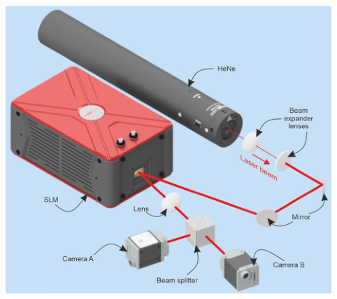
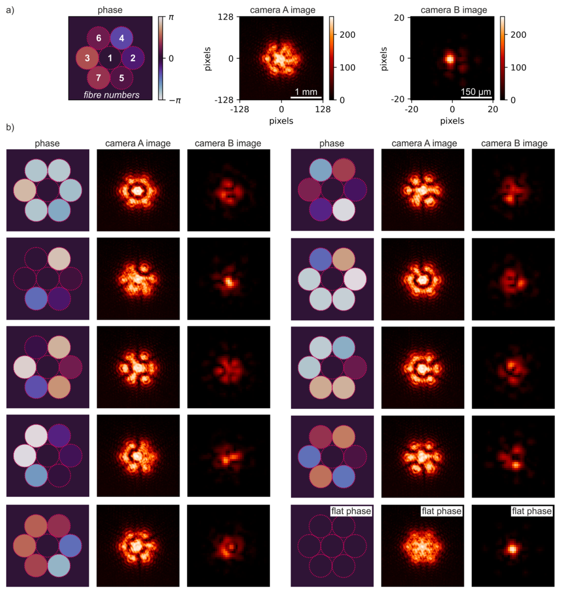
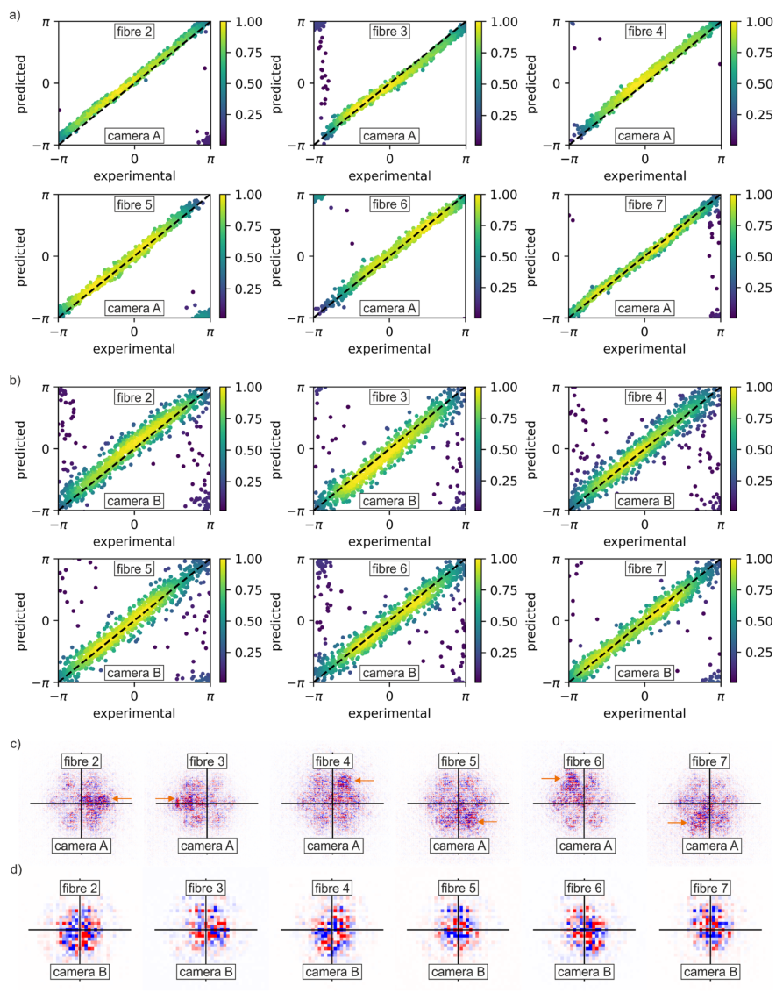
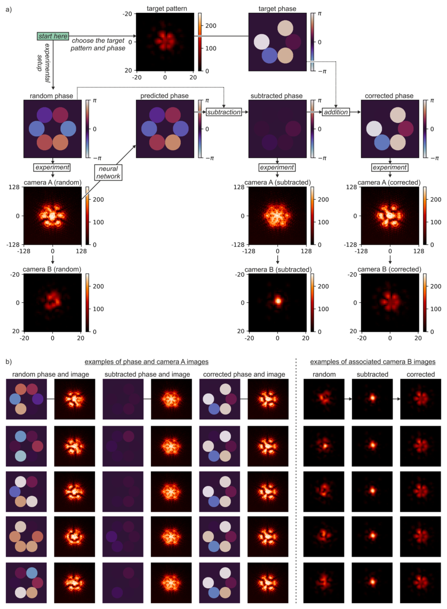
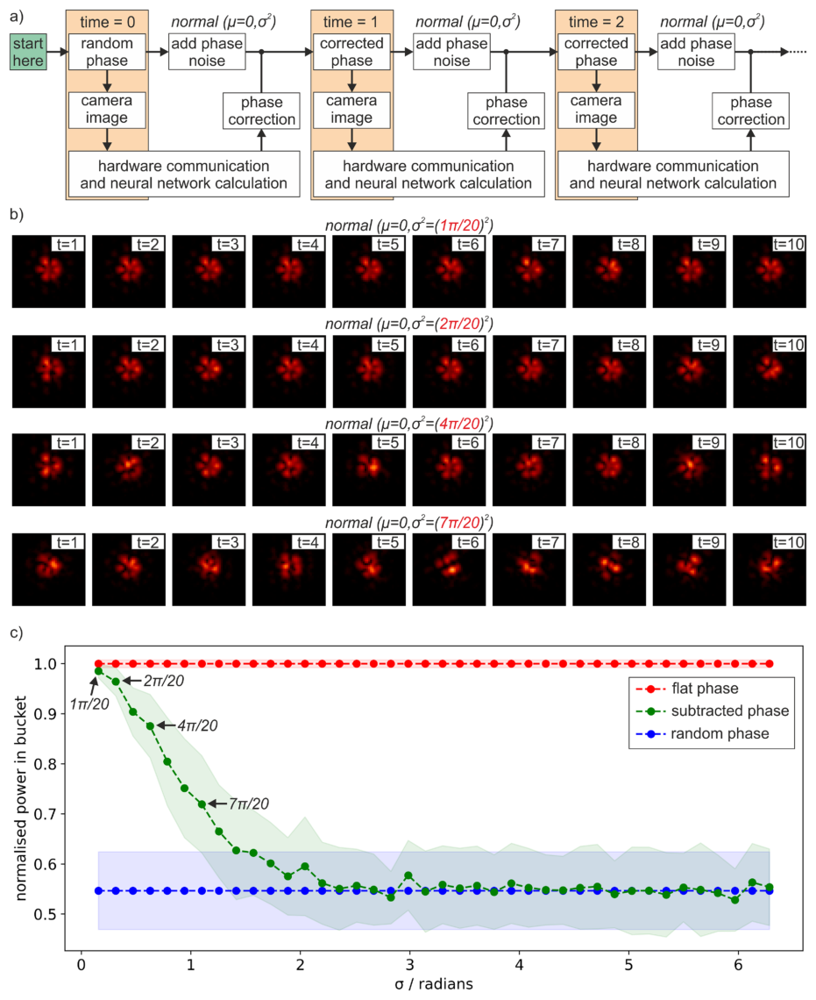
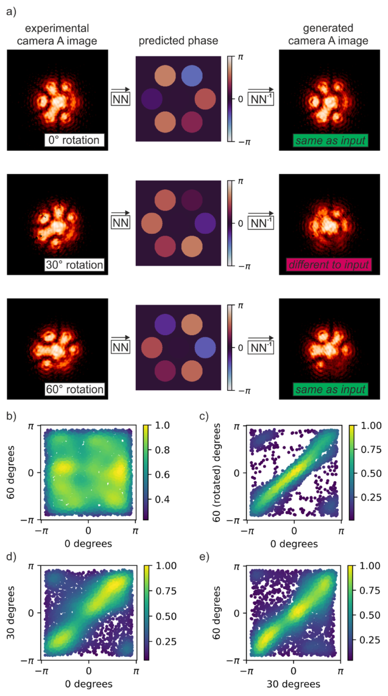
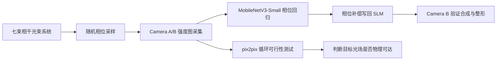
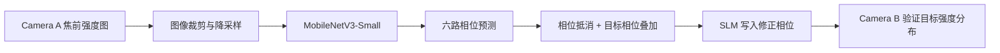

---
title: "Single-step phase identification and phase locking for coherent beam combination using deep learning"
title_zh: "基于深度学习的相干光束合成单步相位识别与相位锁定"
authors:
  - Yunhui Xie
  - Fedor Chernikov
  - Ben Mills
  - Yuchen Liu
  - Matthew Praeger
  - James A. Grant-Jacob
  - Michalis N. Zervas
year: "2024"
venue: "Scientific Reports 14:7501"
doi: "10.1038/s41598-024-58251-z"
tags:
  - literature
  - optics/coherent-beam-combining
  - method/deep-learning
  - method/MobileNetV3
  - method/pix2pix
  - task/phase-identification
  - task/beam-shaping
methods:
  - coherent beam combination
  - phase locking
  - MobileNetV3-Small
  - cyclical phase loss
  - gradient attribution
  - pix2pix cyclic feasibility test
material_system: "seven-beam coherent optical array simulated with SLM and HeNe laser"
task_type: "single-step phase identification, real-time phase correction, bespoke beam shaping"
reading_status: "processed"
source_pdf: "source/2024-Xie-single-step-phase-identification-phase-locking.pdf"
created: "2026-06-04"
---

# Single-step phase identification and phase locking for coherent beam combination using deep learning

## 0. 文献元信息

### 0.1 基础信息

| 项目 | 内容 |
|---|---|
| 英文题名 | Single-step phase identification and phase locking for coherent beam combination using deep learning |
| 中文题名 | 基于深度学习的相干光束合成单步相位识别与相位锁定 |
| 作者 | Yunhui Xie, Fedor Chernikov, Ben Mills, Yuchen Liu, Matthew Praeger, James A. Grant-Jacob, Michalis N. Zervas |
| 机构 | Optoelectronics Research Centre, University of Southampton, Southampton, UK |
| 期刊 | Scientific Reports |
| 年份 | 2024 |
| DOI | 10.1038/s41598-024-58251-z |
| 系统 | SLM 模拟的七通道相干光束合成系统，HeNe 激光，Camera A 焦前成像，Camera B 焦平面成像 |
| 核心方法 | MobileNetV3-Small 相位回归，周期相位损失，实时闭环相位校正，pix2pix 可行性循环测试 |

### 0.2 Abstract 中英文对照

> 合规短摘：coherent beam combination; single-step; high-speed correction; deep learning.

**中文专业转述：**  
相干光束合成可以突破单根光纤功率承载能力的限制，但合成后的强度分布高度依赖各通道之间的相对相位。工程难点在于：实际系统中相位信息通常不能直接测得，而且光纤激光系统存在持续变化的相位噪声，因此需要一种单步、快速、可实时闭环的相位识别与补偿方法。本文用空间光调制器构建七束光相干合成实验系统，并训练深度学习模型直接从合成强度图样中识别各束光的相对相位偏移，实现实时相位校正。进一步地，模型还能计算达到用户指定目标强度轮廓所需的相位补偿，从而把光束合成和光束整形合并为一个深度学习驱动的控制过程。

### 0.3 Conclusion 中英文对照

> 合规短摘：single-step bespoke beam shaping; seven beams; closed-loop feedback; random phase noise.

**中文专业转述：**  
论文最终证明：在由空间光调制器产生的七束光相干合成系统中，深度学习可以从单张相机强度图中识别每一路光束相位，并在闭环反馈中实现相位锁定和定制光束整形。实验展示了在随机相位噪声存在时仍能生成稳定的“花瓣形”目标强度分布，说明这种方法不仅能做传统意义上的相干合成，还能进一步服务于目标光场设计。不过，作者也强调了实际光纤激光系统中的推理时延、相机数据传输、执行器响应、相位噪声、波长漂移和系统尺度扩展等问题，这些将决定该方法从实验验证走向高功率工程系统的可行性。

## 1. 快速总结表

| 模块 | 内容 |
|---|---|
| 文章信息 | 2024 年 Scientific Reports；Yunhui Xie 等；DOI: 10.1038/s41598-024-58251-z |
| 研究背景 | 高功率光纤激光受单纤功率承载限制，相干光束合成可把多路光束叠加成更高功率输出，但相位失配会破坏合成效率和光场形状。 |
| 研究目的 | 用深度学习从单张强度图中直接识别七束光的相对相位，并在实时闭环中完成相位锁定和目标光束整形。 |
| 核心方法 | SLM 产生七个可控相位圆孔；Camera A 在焦前采集更含相位局部信息的图样，Camera B 在焦平面验证合成效果；MobileNetV3-Small 回归 6 个外环相位；pix2pix 构建强度图与相位图之间的循环可行性测试。 |
| 关键结果 | Camera A 相位预测误差约 0.26 ± 0.08 rad，优于 Camera B 的约 0.41 ± 0.21 rad；单次推理约 3.8 ± 0.5 ms；在相位噪声低于约 4π/20 时仍能保持较好的花瓣形目标光束。 |
| 主要结论 | 焦前强度图比焦平面图更适合相位识别；深度学习可将相干合成、相位锁定和目标光场整形连接成单步闭环控制流程。 |
| 文章好在哪里 | 不是只做仿真，而是有实验系统、实时闭环、相机位置对比、可解释性归因图、噪声鲁棒性测试和物理可行性判断。 |
| 是否值得深读 | 值得。它对 CBC、逆问题、物理约束深度学习、实时光学控制都有直接借鉴价值。 |

## 2. 125 笔记整理表

| 类型 | 内容 | 对我研究/写作的用法 |
|---|---|---|
| 1 个思路 | 不直接测相位，而是让神经网络从强度干涉图中反推出相位补偿。 | 适合作为“不可直接观测物理量的图像代理反演”写作模板。 |
| 2 个图表 1 | Figure 3 用预测误差和 attribution map 证明焦前图像更含相位局部信息。 | 写模型解释性时，可模仿“性能指标 + 可解释性证据”的组合。 |
| 2 个图表 2 | Figure 5 用相位噪声标准差和 power-in-bucket 指标评估实时闭环抗扰动能力。 | 写鲁棒性实验时，可模仿“噪声参数扫描 + 任务指标退化曲线”。 |
| 5 个句式 1 | "The key bottleneck is not measurement itself, but the unobservability of the control variable." | 可用于引出逆问题或隐变量控制问题。 |
| 5 个句式 2 | "A single camera frame is used as a proxy for the hidden phase state." | 可用于说明图像到物理状态的代理映射。 |
| 5 个句式 3 | "The model closes the loop between sensing, inference, and actuation." | 可用于描述闭环控制类 AI 系统。 |
| 5 个句式 4 | "Performance is evaluated not only by prediction error but also by downstream optical quality." | 可用于强调任务指标比单纯误差更重要。 |
| 5 个句式 5 | "The cyclic test distinguishes physically attainable targets from visually specified but infeasible patterns." | 可用于写生成模型与物理可行性筛选。 |

## 3. 图表证据链

### Figure 1. Experimental setup

| 维度 | 解析 |
|---|---|
| 目的 | 说明实验系统如何用 SLM 模拟七路相干光束，并如何同时获得焦前和焦平面图像。 |
| 描述 | HeNe 激光扩束后照射 SLM，SLM 上定义七个圆形区域表示七个光纤通道；透镜使光束重叠；Camera A 位于焦前，Camera B 位于焦平面。 |
| 结论 | 作者把“相位可控的多束光阵列”和“双位置强度观测”做成了可训练、可验证的实验闭环。 |
| 支撑 | 该图是全文实验可信度的底座：后续所有相位识别、比较和闭环整形都依赖这个光路。 |
| 可复用性 | 写实验系统时可用“源-调制-合束-双传感-反馈”的链式结构组织光学平台。 |

### Figure 2. Dataset and camera-image representation

| 维度 | 解析 |
|---|---|
| 目的 | 展示训练数据如何由相位标签、Camera A 图像和 Camera B 图像构成。 |
| 描述 | 每个样本包含七通道相位分布、焦前图像和焦平面图像；外环六个相位从 -π 到 +π 随机采样，中心相位固定为 0π。 |
| 结论 | 该任务本质是从二维干涉图像回归 6 维周期相位向量。 |
| 支撑 | 证明数据不是纯模拟，而是实验采集并经过裁剪、降采样、归一化后进入网络。 |
| 可复用性 | 适合迁移到“图像观测 + 隐变量标签”的实验数据集描述。 |

### Figure 3. Phase prediction accuracy and attribution maps

| 维度 | 解析 |
|---|---|
| 目的 | 比较焦前 Camera A 与焦平面 Camera B 对相位识别的贡献，并解释为什么焦前更有效。 |
| 描述 | Camera A 平均预测误差约 0.26 rad，Camera B 约 0.41 rad；归因图显示 Camera A 中与某一路光束相位相关的信息更局部、更不对称。 |
| 结论 | 相位信息在焦前图像中更容易被网络局部定位，而焦平面图像的傅里叶分布使信息更平均扩散。 |
| 支撑 | 这是全文最重要的模型证据：不仅说明模型有效，还解释了“在哪里看”更适合做相位反演。 |
| 可复用性 | 可用于学习“误差统计 + attribution map + 物理解释”的三层证据写法。 |

### Figure 4. Real-time phase correction and petal beam generation

| 维度 | 解析 |
|---|---|
| 目的 | 展示从随机相位到目标花瓣光束的实时闭环流程。 |
| 描述 | 系统先采集随机相位下的 Camera A 图像，由神经网络预测相位，再减去预测相位并叠加目标相位，最终在 Camera B 中得到花瓣形强度分布。 |
| 结论 | 深度学习不只是离线识别器，而是嵌入了实际相位补偿链路。 |
| 支撑 | 该图把“相位识别”升级为“相位锁定 + 光束整形”的工程控制流程。 |
| 可复用性 | 写闭环控制系统时，可借鉴“观测-推理-补偿-目标变换-验证”的流程图。 |

### Figure 5. Phase-noise robustness during real-time shaping

| 维度 | 解析 |
|---|---|
| 目的 | 检验推理与执行期间新增相位噪声对目标光束质量的影响。 |
| 描述 | 作者在计算与校正之间人为加入不同标准差的随机相位噪声，并观察花瓣光束质量及 power-in-bucket 指标变化。 |
| 结论 | 当噪声标准差较低时，目标形状稳定；超过约 4π/20 后，花瓣形质量明显下降。 |
| 支撑 | 该图说明实时性不是附属问题，而是决定方法能否进入真实光纤激光系统的核心约束。 |
| 可复用性 | 可迁移到任何“模型推理时间内系统状态漂移”的鲁棒性评估。 |

### Figure 6. Cyclic feasibility test with paired neural networks

| 维度 | 解析 |
|---|---|
| 目的 | 判断用户指定的目标强度图样是否在当前七束 CBC 系统中物理可实现。 |
| 描述 | 两个 pix2pix 网络分别学习强度图到相位图、相位图到强度图的映射；若输入图经过循环变换后能重建，则更可能是系统可实现的光场。 |
| 结论 | 0° 和 60° 旋转符合六角阵列对称性，30° 旋转破坏物理可达性，因此循环重建失败或相位预测呈混乱相关。 |
| 支撑 | 该图把深度学习从“控制器”进一步扩展为“物理可行性判别器”。 |
| 可复用性 | 很适合借鉴到逆设计：不是所有视觉上想要的目标都在物理系统约束内可达。 |

**表格检测：** 未检测到正式 Table caption；本文主要证据由 6 张 Figure 构成。

## 4. 方法与图表复用

### 方法骨架

1. 用 SLM 构造七路相干光束阵列，中心相位固定，外环六路相位作为待预测变量。
2. 随机采样外环相位，采集 Camera A 与 Camera B 图像，形成图像-相位监督数据。
3. 将图像裁剪到 1024×1024，再降采样到 256×256，作为单通道 8-bit 输入。
4. 用 MobileNetV3-Small 输出 6 个相位值，损失函数采用周期相位损失：

$$
L = 2 - 2\cos(\theta - \phi)
$$

其中，\(\theta\) 是网络预测相位，\(\phi\) 是实验设定相位。这个损失比普通均方误差更适合相位，因为 \(-\pi\) 与 \(+\pi\) 在物理上是连续邻近的。

5. 训练完成后，将网络嵌入实时控制系统，从 Camera A 图像预测相位，计算补偿，相位写回 SLM。
6. 用 Camera B 验证焦平面合成效果和目标光束形状。

### 可复用图表逻辑

| 图 | 可复用逻辑 |
|---|---|
| Figure 1 | 实验平台总图：说明控制对象、传感器位置和反馈链路。 |
| Figure 2 | 数据集构成图：把标签、输入图、验证图并列展示。 |
| Figure 3 | 性能 + 可解释性：误差分布与 attribution map 共同证明模型学到物理信息。 |
| Figure 4 | 实时闭环流程：从随机初态到目标态。 |
| Figure 5 | 鲁棒性：用噪声水平扫描展示方法边界。 |
| Figure 6 | 可行性判别：用循环重建判断目标是否符合物理约束。 |

## 5. 中英陪读

| 关键词 | 中文解释 |
|---|---|
| coherent beam combination, CBC | 相干光束合成，通过控制多束光相位使其相干叠加，提高功率或塑造光场。 |
| phase locking | 相位锁定，让多路光束保持所需相位关系，避免干涉图样漂移。 |
| spatial light modulator, SLM | 空间光调制器，可给不同空间区域加载不同相位，相当于可编程相位阵列。 |
| focal plane / before focal plane | 焦平面 / 焦前位置；本文发现焦前图像携带更局部的相位线索。 |
| attribution map | 归因图，显示输入图像中哪些像素对网络预测最重要。 |
| power in the bucket | 桶内功率，一种衡量能量集中到目标区域程度的指标。 |
| pix2pix | 条件生成对抗网络架构，用于图像到图像转换。 |

**长句拆解示例：**

短摘：single-step and high-speed correction process.

这句话的核心不是“深度学习很快”，而是工程系统要求“单步 + 高速”。单步意味着不能靠多轮随机搜索慢慢调；高速意味着相位噪声还没明显漂移前，系统就要完成相机读取、网络推理和执行器写入。

## 6. Daedalus 深度剖析

### Act I: Opening Gambit - 核心价值命题

这篇论文的核心贡献在于，它把相干光束合成中的相位控制问题，从“看不见相位所以只能迭代优化”的传统困境，推进为“从单张强度图直接推断隐含相位并实时补偿”的闭环控制问题。真正的技术瓶颈不是相机能不能拍到光斑，而是强度图到相位状态之间存在非唯一、周期性、受噪声扰动的逆问题。作者用实验采集数据训练 MobileNetV3-Small，把焦前强度图转化为六个相对相位预测，再将预测结果写回 SLM 完成相位锁定和目标光束整形。最有价值的证据是：Camera A 的相位识别优于焦平面 Camera B，实时闭环能生成稳定花瓣光束，pix2pix 循环测试还能判断某个目标强度图是否物理可达。

### Act II: Narrative Unfolding - 从真实工程到科学核心

**问题的起源。** 高功率光纤激光需要更高输出功率，但单根光纤存在功率承载、热效应和非线性效应等限制。相干光束合成的思路是把多路光束像阵列一样组合起来，通过相位一致性获得高亮度输出。

**科学挑战。** 合成强度图由多路相干干涉共同决定，相位是隐藏变量。只看强度图时，可能存在多个相位组合对应相似强度分布；真实光纤系统还会有持续相位噪声。因此，慢速迭代优化或只追求单一峰值的算法不能完全满足定制光场和实时控制。

**论文宏观蓝图。**

**摘要与结论。** 见 `## 0.2` 和 `## 0.3`。这里保留的是合规短摘和中文专业转述；未大段复制原文。

### Act III: Technical Heart - 精密方法拆解

**理论基石。** CBC 的核心是相位相干。若七路光束的相位关系失控，焦平面能量会从目标峰值或目标图样中泄漏出去。相机记录的是强度 \(I\)，而控制器真正需要的是相位 \(\phi_i\)。这就是一个典型的隐藏状态反演问题。

**关键实验设定。** SLM 上定义七个圆形区域，模拟六角紧密排列的七个光纤通道。中心相位固定为 0π，外环六个通道相位在 \(-\pi\) 到 \(+\pi\) 之间随机采样。Camera A 位于焦前 5 cm，Camera B 位于焦平面。

**数据与模型。** 图像先裁剪为 1024×1024，再降采样为 256×256。网络基于 MobileNetV3-Small，输入改为 256×256 单通道图，输出层改为 6 维相位预测。训练采用 Adam，学习率 0.0001，dropout 20%。Camera A 数据集约 18,114 张，Camera B 数据集约 26,071 张，均采用 90/10 训练验证划分。

**周期损失函数。** 普通回归损失会误判相位边界，例如 \(-\pi\) 与 \(+\pi\) 在数值上相距很远，但物理上几乎等价。作者采用：

$$
L = 2 - 2\cos(\theta - \phi)
$$

当预测相位 \(\theta\) 与真实相位 \(\phi\) 相同时，损失最小；当二者相差 \(\pi\) 时，损失最大。这使网络学习的是相位圆环上的距离，而不是实数直线上的距离。

**算法逻辑。** 训练阶段，网络学习“强度干涉纹理 → 六个相位值”的映射。控制阶段，系统用 Camera A 的实时图像预测当前相位，计算抵消相位，再叠加目标光束所需相位。于是网络既是状态估计器，也是闭环控制链条中的关键中间环节。

### Act IV: Chain Of Evidence - 结果证据链

**实验平台证据。** Figure 1 证明作者搭建了可控相位阵列和双相机观测系统。它让后文的所有数据都有明确物理来源，而不是黑箱仿真。

**数据构成证据。** Figure 2 展示了相位标签、焦前图像、焦平面图像的配对关系。这说明网络输入输出是受控实验生成的监督学习问题。

**模型有效性与物理解释证据。** Figure 3 是核心证据。Camera A 误差更低，归因图更局部，说明焦前图像中的条纹和散斑包含更可分离的相位线索。作者不是只给一个误差数字，而是用 attribution map 回答“模型为什么能预测”。

**闭环控制证据。** Figure 4 说明网络预测不是离线结果，而是能进入实际控制链路，使随机相位经过补偿后形成目标花瓣光束。

**鲁棒性证据。** Figure 5 通过额外相位噪声扫描说明方法边界。低噪声下图样保持，噪声升高后质量下降，表明实时速度和执行延迟是工程落地的关键。

**物理可行性证据。** Figure 6 通过 pix2pix 循环测试说明深度学习还能判断“目标图样是否可由当前系统产生”。这一步非常漂亮，因为它把神经网络从单纯的控制器扩展成物理约束空间的判别工具。

### Act V: Intellectual Distillation - 页外洞察

**隐含假设。** 方法假设训练分布能覆盖运行时相位状态；光束几何位置、相机位置、波长和光路稳定性不能偏离训练条件太多；输入图像不能饱和；SLM 模拟系统与真实高功率光纤系统之间仍存在执行器和噪声动态差异。

**技术巧思。** 第一，作者没有默认焦平面图像最好，而是实验证明焦前图像更适合相位反演。第二，周期损失函数准确处理了相位的环形拓扑。第三，归因图把深度学习结果连接回干涉条纹物理。第四，pix2pix 循环测试把“想要的光场”和“系统能否实现”区分开。

**关键 aha 时刻。** 这篇论文最值得记住的观点是：相位信息并没有消失，它以干涉纹理的形式编码在强度图中；正确的观测平面和正确的模型损失，能让网络把这个隐变量读出来。

**局限。** 七束 SLM 模拟系统仍小于真实高功率 CBC 阵列；真实系统中的波长漂移、相位执行器速度、相机传输延迟、热漂移和高功率非线性都可能降低性能。作者也承认波长变化比功率波动更危险，因为它会改变条纹位置或空间频率。

### Act VI: Legacy And Outlook - 知识迁移与未来方向

**可迁移工具箱。** 本文的方法可迁移到其他“隐藏物理状态无法直接测量，但可由图像间接推断”的系统，例如自适应光学、激光加工在线控制、光学阵列校准、超表面调控和多执行器场分布控制。

**复现实验建议。** 复现时应优先保证相机位置、图像裁剪区域、曝光不饱和、相位标签同步和执行器响应时间。先复现 Camera A 的相位回归，再做闭环补偿，最后再做目标光束整形。

**高价值未来方向。**

1. 将 SLM 模拟系统迁移到真实多通道光纤放大器阵列，测试高功率、热漂移和执行器动态下的鲁棒性。
2. 训练具备几何泛化能力的模型，使光束数量、阵列排列或相机位置变化时不必完全重采数据。
3. 将物理模型嵌入网络或损失函数，减少训练样本需求并提升对波长漂移的鲁棒性。
4. 用轻量化模型、硬件裁剪、FPGA/GPU 边缘推理降低闭环延迟。

**首席科学家建议。** 这篇论文的战略价值不只是“用 AI 调激光”，而是展示了一条范式：把复杂光学系统中的不可见控制变量转化为可学习的视觉反演问题，再用闭环执行把反演结果变成目标物理状态。后续工作若能把稳定性、泛化和硬件速度做扎实，就有机会成为高功率 CBC 控制的核心路线之一。

## 7. 写作素材库

| 用途 | 可复用表达 |
|---|---|
| 引出问题 | 相干合成的核心限制并非能量叠加本身，而是多通道相位关系的实时可观测性与可控性。 |
| 描述方法 | 本文将单张强度图像视为隐藏相位状态的代理观测，并训练轻量化卷积网络完成周期变量回归。 |
| 描述证据 | 作者用预测误差、归因图、闭环成形和噪声扫描构成了从模型精度到工程可用性的证据链。 |
| 描述局限 | 该方法的工程落地取决于训练分布、光路稳定性、波长漂移、相机传输和相位执行器响应速度。 |
| 迁移句式 | 这种“图像代理观测 + 物理隐变量反演 + 闭环执行”的框架可迁移到多种光场控制问题。 |

## 8. 局限与复核清单

| 项目 | 状态 |
|---|---|
| PDF 文本抽取 | PyMuPDF 抽取成功，共 13 页。 |
| 图像抽取 | 成功抽取 Figure 1-6，共 6 张。 |
| 表格抽取 | 未检测到正式表格。 |
| Abstract 原文 | 因版权合规限制，未大段复制；已提供短摘和中文专业转述。 |
| Conclusion 原文 | 因版权合规限制，未大段复制；已提供短摘和中文专业转述。 |
| 图像裁剪 | 基于 PDF 图像块裁剪，建议用户在 Typora 中快速目检 Figure 2-6 是否边界完整。 |
| LaTeX | 已使用单反斜杠命令，适配 Typora Markdown。 |
| 领域偏差 | 本文为光学 CBC 与深度学习论文，未套用碳纤维复合材料模板。 |

## 本论文的通用知识迁移总结

- **核心思想**：当关键物理变量不可直接观测时，可以寻找包含该变量信息的代理观测，例如强度图像，并用深度学习建立反演映射。
- **可复用模块**：实验数据配对、周期变量损失、焦平面位置对比、归因图解释、闭环鲁棒性扫描、循环物理可行性测试。
- **关键避坑指南**：不要只看模型误差，还要看闭环执行效果；不要默认目标图样物理可达；不要忽视相机传输、推理时延和执行器响应这些工程瓶颈。
